```{r setup, include=FALSE}
knitr::opts_chunk$set(echo = TRUE, message=F,warning=F)
```

```{css, echo=F, eval=T}
<style>
  div.content h1 {
    margin-left: 20px;
  }

  div.content h2 {
    margin-left: 40px;
  }

  div.content h3 {
    margin-left: 60px;
  }

  div.content h4 {
    margin-left: 80px;
  }

  div.content h5 {
    margin-left: 100px;
  }

  div.content h6 {
    margin-left: 120px;
  }
</style>

```

<div class="content">

```{r, echo=F, message=F, warning=F}
rm(list=ls())

library(tidyverse)
library(FactoMineR)
library(spdep)
library(sf)
library(readxl)
library(leaflet)
library(leaflet.extras)
library(htmlwidgets)
library(webshot)
```


<br>
<br>


# Liste des indicateurs utilisés dans la MAJ

<!--
Script pour calculer les nouveaux indicateurs
-->
```{r Calcul_indicateurs_MAJ, echo=F, eval=F}
rm(list=ls())

nb_mailles=36
population_min=2500

load("Données/Donnees_Logement_MAJ.Rdata")
Donnees_Logement=Donnees_Logement_MAJ
Import_carteCommunesCorses=st_read("Données/SHP_COMMUNES/COMMUNE.shp")
carteCommunesCorses=Import_carteCommunesCorses %>% select(INSEE_COM,geometry)
colnames(carteCommunesCorses)[1]="CODGEO"
carteCommunesCorses=carteCommunesCorses %>% arrange(CODGEO)
carteCommunesCorses <- st_transform(carteCommunesCorses, crs = 4326)

Indicateurs_parCommune= Donnees_Logement %>% 
  mutate(indic.transac = round(100 * nb_mut / LOG, 1),
         indic.menag = round(POP/RP, 1),
         indic.rs = round(100 * RSECOCC / LOG, 1),
         indic.lv = round(100 * LOGVAC / LOG, 1),
         indic.jeun = round(jeun / anc, 1),
         indic.social = round(100 * social / tot_lgmt, 1),
         indic.prop = round(100 * proprietaire / RP, 1),
         indic.duroc = duroc,
         indic.prix = round(100 * moyenne_prix/rev_ucm, 1),
         indic.airbnb.nb_lgmt=round(100*Loc.actives/LOG, 1),
         indic.airbnb.revTot_annee=rev.LTM_tot,
         indic.airbnb.revMoy_lgt=rev.LTM_moy_lgt,
         indic.log=LOG) %>% 
  select(CODGEO,LIBGEO,POP,LOG,contains("indic"))
Indicateurs_parCommune=Indicateurs_parCommune %>% mutate_if(is.numeric, funs(ifelse(is.na(.), 0, .)))

winsorisation= function (x, prob.min = 0.01, prob.max = .99){
  a <- quantile(x, probs = c(prob.min, prob.max))
  x[x > a[2]] <- a[2]
  x[x < a[1]] <- a[1]
  return(x)
}
listeIndicateurs=Indicateurs_parCommune %>% select(contains("indic")) %>% names()
Indicateurs_parCommune[listeIndicateurs]=apply(Indicateurs_parCommune[listeIndicateurs],MARGIN = 2, FUN = winsorisation)
Indicateurs_parCommune_valeurs=Indicateurs_parCommune[listeIndicateurs] 
carteCommunesCorses_spdf=carteCommunesCorses %>% left_join(Indicateurs_parCommune,by="CODGEO")%>% select(CODGEO,LIBGEO,POP) %>%  as("Spatial")
table_voisinage=poly2nb(carteCommunesCorses_spdf,queen=F)
ACP_parCommunes <- Indicateurs_parCommune_valeurs %>%  PCA(graph = F)
nb_dim <- which(ACP_parCommunes$eig[, 3] > 80)[1] 
ACP_parCommunes <- Indicateurs_parCommune_valeurs %>%  PCA(graph = F,ncp = nb_dim)
donnees_pondérations=ACP_parCommunes$ind$coord
pondérations=nbcosts(table_voisinage, data = donnees_pondérations)
table_voisinage_pondérée=nb2listw(table_voisinage, glist = pondérations, style = "C")
arbre_poids_minimal <- mstree(table_voisinage_pondérée)

resultat_skater=skater(edges = arbre_poids_minimal[,1:2],data=donnees_pondérations,ncuts=nb_mailles-1,crit=population_min,vec.crit=Donnees_Logement$POP)

carteMailles=carteCommunesCorses %>% mutate(maille=resultat_skater$groups) %>%  group_by(maille) %>%  summarise(geometry = st_union(geometry))

Maillage=data.frame(CODGEO=Indicateurs_parCommune$CODGEO,maille=resultat_skater$groups)

Indicateurs_parMaille=Maillage %>% 
  left_join(Donnees_Logement, by="CODGEO") %>% 
  group_by(maille) %>% 
  summarise_if(is.numeric, funs(sum(., na.rm = TRUE))) %>% 
  mutate(indic.transac = round(100 * nb_mut / LOG, 1),
         indic.menag = round(POP/RP, 1),
         indic.rs = round(100 * RSECOCC / LOG, 1),
         indic.lv = round(100 * LOGVAC / LOG, 1),
         indic.jeun = round(jeun / anc, 1),
         indic.social = round(100 * social / tot_lgmt, 1),
         indic.prop = round(100 * proprietaire / tot_lgmt, 1),
         indic.duroc = duroc,
         indic.prix = round(100 * moyenne_prix/rev_ucm, 1),
         indic.airbnb.nb_lgmt=round(100*Loc.actives/LOG, 1),
         indic.airbnb.revTot_annee=rev.LTM_tot,
         indic.airbnb.revMoy_lgt=rev.LTM_moy_lgt,
         indic.log=LOG) %>%  
  select(maille,POP,LOG,contains("indic")) %>% 
  mutate_if(is.numeric, funs(ifelse(is.na(.), 0, .)))


Indicateurs_parMaille_valeurs=Indicateurs_parMaille %>% select(contains("indic"))
Indicateurs_parMaille_valeurs=Indicateurs_parMaille_valeurs %>% apply(MARGIN = 2, FUN = winsorisation)
acp_parMailles=PCA(Indicateurs_parMaille_valeurs,ncp=5,graph=F)
hc4 <- HCPC(acp_parMailles, nb.clust = 4, consol = T, graph = F)
cl4 <- data.frame(maille = Indicateurs_parMaille$maille, cl_maille4 = hc4$data.clust[,"clust"])
carteMaillesSecteurs <- left_join(carteMailles, cl4, by = "maille")

carteCommunesCorses_merged <- left_join(carteCommunesCorses, Donnees_Logement, by = "CODGEO")
carteCommunesCorses_sf <- st_as_sf(carteCommunesCorses_merged)
```


Les précédents indicateurs (données de 2017) sont mis à jour avec des données plus récentes et de nouveaux indicateurs sont ajoutés.


<br>

## 1) indic.transac

<br>
<strong>
Nombre de transactions rapporté au nombre de logements (Source : DV3F 2018 - 2021) 
</strong>

<span style="color:green"><strong>
Données mises à jour (période 2018 - 2021)
</strong>
</span>

```{r, incude=F, echo=F, eval=F}
indic=Indicateurs_parCommune %>% select(CODGEO,indic=indic.transac)
carteCommunesCorses_indic_sf=left_join(carteCommunesCorses_sf, indic, by = "CODGEO")

palette <- colorBin(palette = rev(heat.colors(30)), domain = carteCommunesCorses_indic_sf$indic, bins=30)
palette_continue <- colorNumeric(palette = rev(heat.colors(30)), domain = range(carteCommunesCorses_indic_sf$indic))


carte_indic = leaflet(carteCommunesCorses_indic_sf) %>%
  addPolygons(fillColor = ~palette(indic),
              fillOpacity = 0.8,
              color = "gray",
              weight = 1, popup = ~paste("<strong>Commune:</strong>", carteCommunesCorses_indic_sf$LIBGEO, "<br>",
                   "<strong>Valeur:</strong>", carteCommunesCorses_indic_sf$indic))

# carte_indic = carte_indic %>%
#   addLegend(position = "topleft",
#             pal = palette_continue,
#             values = ~indic,
#             opacity = 1, bins=2)

widget_file1 <- "Cartes_Interactives/carte_interactive_1.html"
saveWidget(carte_indic, file = widget_file1)
webshot("Cartes_Interactives/carte_interactive_1.html", file = "Cartes_Interactives/carte1.png",vwidth = 860, vheight = 860)
```

<br>
*Cliquer sur l'image pour afficher la carte interactive*
<a href="Cartes_Interactives/carte_interactive_1.html" target="_blank">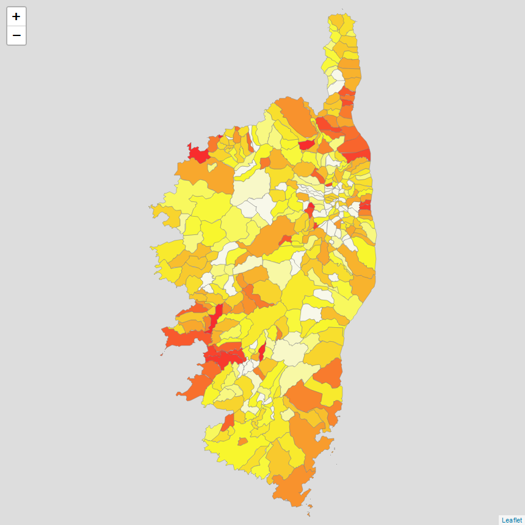</a>

<br>
<br>

## 2) indic.menag

<br>
<strong>
Nombre de personnes par ménage (Source : INSEE, RP)  
</strong>

<span style="color:green"><strong>
Données mises à jour (2019).
</strong>
</span>

```{r, incude=F, echo=F, eval=F}
indic=Indicateurs_parCommune %>% select(CODGEO,indic=indic.menag)
carteCommunesCorses_indic_sf=left_join(carteCommunesCorses_sf, indic, by = "CODGEO")

palette <- colorBin(palette = rev(heat.colors(30)), domain = carteCommunesCorses_indic_sf$indic, bins=30)
palette_continue <- colorNumeric(palette = rev(heat.colors(30)), domain = range(carteCommunesCorses_indic_sf$indic))


carte_indic = leaflet(carteCommunesCorses_indic_sf) %>%
  addPolygons(fillColor = ~palette(indic),
              fillOpacity = 0.8,
              color = "gray",
              weight = 1, popup = ~paste("<strong>Commune:</strong>", carteCommunesCorses_indic_sf$LIBGEO, "<br>",
                   "<strong>Valeur:</strong>", carteCommunesCorses_indic_sf$indic))

# carte_indic = carte_indic %>%
#   addLegend(position = "topleft",
#             pal = palette_continue,
#             values = ~indic,
#             opacity = 1, bins=2)

widget_file2 <- "Cartes_Interactives/carte_interactive_2.html"
saveWidget(carte_indic, file = widget_file2)
webshot("Cartes_Interactives/carte_interactive_2.html", file = "Cartes_Interactives/carte2.png",vwidth = 860, vheight = 860)
```

<br>
*Cliquer sur l'image pour afficher la carte interactive*
<a href="Cartes_Interactives/carte_interactive_2.html" target="_blank">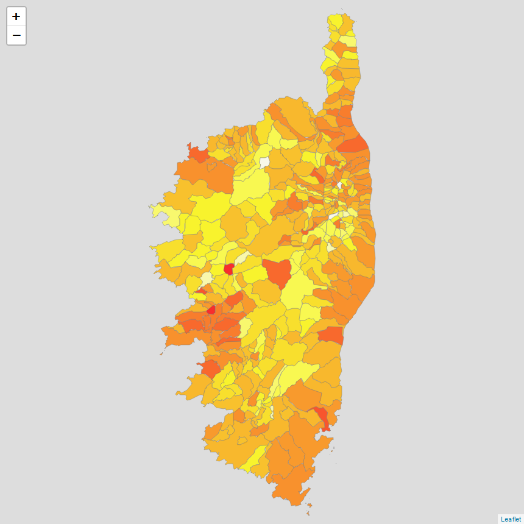</a>

<br>
<br>

## 3) indic.rs

<br>
<strong>
Taux de résidences secondaires (Source : INSEE, RP)  
</strong>

<span style="color:green"><strong>
Données mises à jour (2019).
</strong>
</span>

```{r, incude=F, echo=F, eval=F}
indic=Indicateurs_parCommune %>% select(CODGEO,indic=indic.rs)
carteCommunesCorses_indic_sf=left_join(carteCommunesCorses_sf, indic, by = "CODGEO")

palette <- colorBin(palette = rev(heat.colors(30)), domain = carteCommunesCorses_indic_sf$indic, bins=30)
palette_continue <- colorNumeric(palette = rev(heat.colors(30)), domain = range(carteCommunesCorses_indic_sf$indic))


carte_indic = leaflet(carteCommunesCorses_indic_sf) %>%
  addPolygons(fillColor = ~palette(indic),
              fillOpacity = 0.8,
              color = "gray",
              weight = 1, popup = ~paste("<strong>Commune:</strong>", carteCommunesCorses_indic_sf$LIBGEO, "<br>",
                   "<strong>Valeur:</strong>", carteCommunesCorses_indic_sf$indic))

# carte_indic = carte_indic %>%
#   addLegend(position = "topleft",
#             pal = palette_continue,
#             values = c(mini,maxi),
#             opacity = 1, bins=2)

widget_file3 <- "Cartes_Interactives/carte_interactive_3.html"
saveWidget(carte_indic, file = widget_file3)
webshot("Cartes_Interactives/carte_interactive_3.html", file = "Cartes_Interactives/carte3.png",vwidth = 860, vheight = 860)
```

<br>
*Cliquer sur l'image pour afficher la carte interactive*
<a href="Cartes_Interactives/carte_interactive_3.html" target="_blank">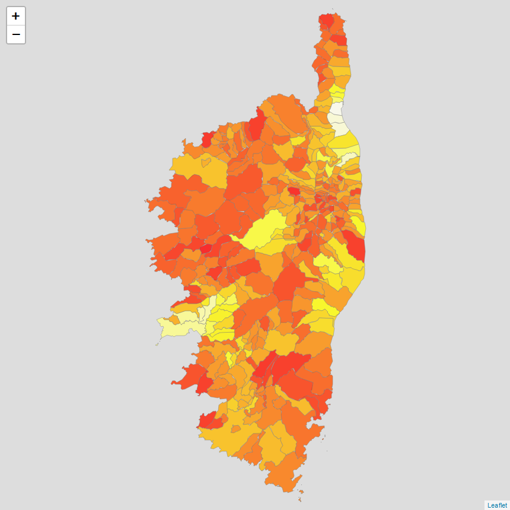</a>

<br>
<br>

## 4) indic.lv

<br>
<strong>
Taux de logements vacants (Source : INSEE, RP)
</strong>

<span style="color:green"><strong>
Données mises à jour (2019).
</strong>
</span>

```{r, incude=F, echo=F, eval=F}
indic=Indicateurs_parCommune %>% select(CODGEO,indic=indic.lv)
carteCommunesCorses_indic_sf=left_join(carteCommunesCorses_sf, indic, by = "CODGEO")

palette <- colorBin(palette = rev(heat.colors(30)), domain = carteCommunesCorses_indic_sf$indic, bins=30)
palette_continue <- colorNumeric(palette = rev(heat.colors(30)), domain = range(carteCommunesCorses_indic_sf$indic))


carte_indic = leaflet(carteCommunesCorses_indic_sf) %>%
  addPolygons(fillColor = ~palette(indic),
              fillOpacity = 0.8,
              color = "gray",
              weight = 1, popup = ~paste("<strong>Commune:</strong>", carteCommunesCorses_indic_sf$LIBGEO, "<br>",
                   "<strong>Valeur:</strong>", carteCommunesCorses_indic_sf$indic))

# carte_indic = carte_indic %>%
#   addLegend(position = "topleft",
#             pal = palette_continue,
#             values = ~indic,
#             opacity = 1, bins=2)

widget_file4 <- "Cartes_Interactives/carte_interactive_4.html"
saveWidget(carte_indic, file = widget_file4)
webshot("Cartes_Interactives/carte_interactive_4.html", file = "Cartes_Interactives/carte4.png",vwidth = 860, vheight = 860)
```

<br>
*Cliquer sur l'image pour afficher la carte interactive*
<a href="Cartes_Interactives/carte_interactive_4.html" target="_blank">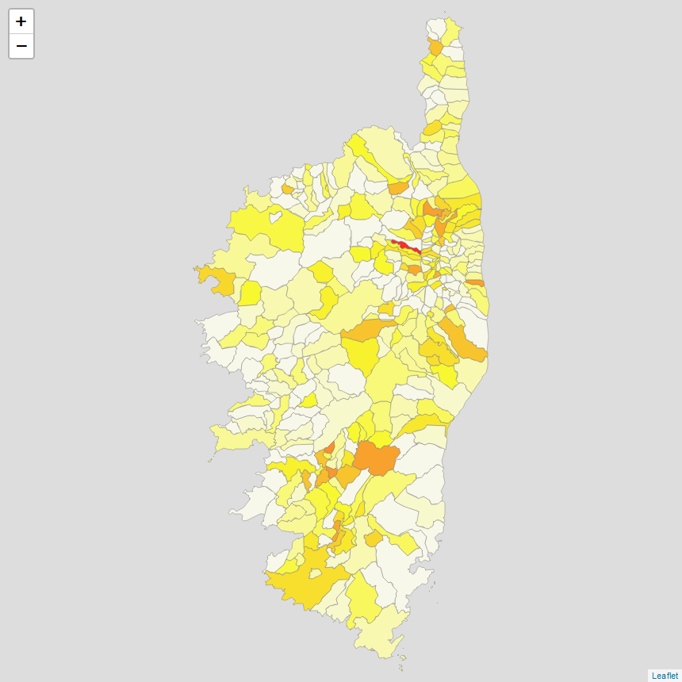</a>

<br>
<br>

## 5) indic.jeun

<br>
<strong>
Jeunesse du parc (nombre de logements construits après 1975 rapporté au nombre de logements construits avant 1949), (Source : FILOCOM)
</strong>

<span style="color:green"><strong>
Données mises à jour (2019). 
Attention : certaines valeurs trop faibles ont été secrétisées dans la base de données FILOCOM de 2019.  
Ces données ont été remplacées par des données fournies par l'INSEE qui correspondent au nombre de logements construits après 1970 rapporté au nombre de logements construits avant 1946.
</strong>
</span>

```{r, incude=F, echo=F, eval=F}
indic=Indicateurs_parCommune %>% select(CODGEO,indic=indic.jeun)
carteCommunesCorses_indic_sf=left_join(carteCommunesCorses_sf, indic, by = "CODGEO")

palette <- colorBin(palette = rev(heat.colors(30)), domain = carteCommunesCorses_indic_sf$indic, bins=30)
palette_continue <- colorNumeric(palette = rev(heat.colors(30)), domain = range(carteCommunesCorses_indic_sf$indic))


carte_indic = leaflet(carteCommunesCorses_indic_sf) %>%
  addPolygons(fillColor = ~palette(indic),
              fillOpacity = 0.8,
              color = "gray",
              weight = 1, popup = ~paste("<strong>Commune:</strong>", carteCommunesCorses_indic_sf$LIBGEO, "<br>",
                   "<strong>Valeur:</strong>", carteCommunesCorses_indic_sf$indic))

# carte_indic = carte_indic %>%
#   addLegend(position = "topleft",
#             pal = palette_continue,
#             values = ~indic,
#             opacity = 1, bins=2)

widget_file5 <- "Cartes_Interactives/carte_interactive_5.html"
saveWidget(carte_indic, file = widget_file5)
webshot("Cartes_Interactives/carte_interactive_5.html", file = "Cartes_Interactives/carte5.png",vwidth = 860, vheight = 860)
```

<br>
*Cliquer sur l'image pour afficher la carte interactive*
<a href="Cartes_Interactives/carte_interactive_5.html" target="_blank">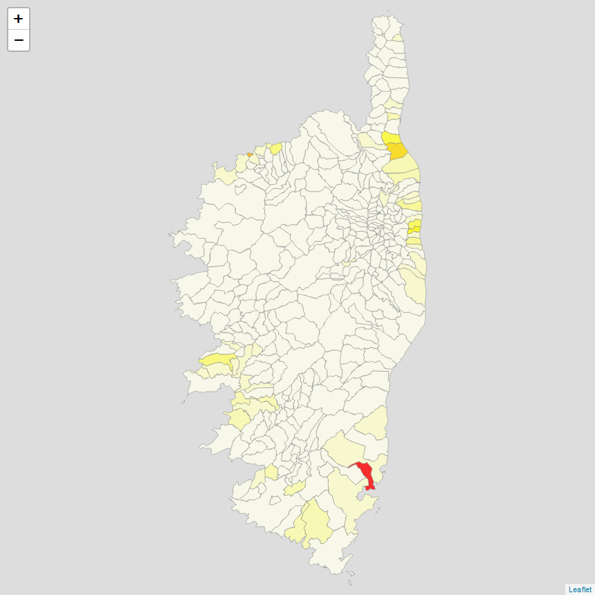</a>

<br>
<br>

## 6) indic.social

<br>
<strong>
Taux de logements sociaux (Source : FILOCOM)
</strong>

<span style="color:green"><strong>
Données mises à jour (2019). 
Attention : certaines valeurs trop faibles ont été secrétisées dans la base de données FILOCOM de 2019.  
Ces données ont été remplacées par les données de l'étude initiale (2017).  
</strong>
</span>


```{r, incude=F, echo=F, eval=F}
indic=Indicateurs_parCommune %>% select(CODGEO,indic=indic.social)
carteCommunesCorses_indic_sf=left_join(carteCommunesCorses_sf, indic, by = "CODGEO")

palette <- colorBin(palette = rev(heat.colors(30)), domain = carteCommunesCorses_indic_sf$indic, bins=30)
palette_continue <- colorNumeric(palette = rev(heat.colors(30)), domain = range(carteCommunesCorses_indic_sf$indic))


carte_indic = leaflet(carteCommunesCorses_indic_sf) %>%
  addPolygons(fillColor = ~palette(indic),
              fillOpacity = 0.8,
              color = "gray",
              weight = 1, popup = ~paste("<strong>Commune:</strong>", carteCommunesCorses_indic_sf$LIBGEO, "<br>",
                   "<strong>Valeur:</strong>", carteCommunesCorses_indic_sf$indic))

# carte_indic = carte_indic %>%
#   addLegend(position = "topleft",
#             pal = palette_continue,
#             values = ~indic,
#             opacity = 1, bins=2)

widget_file6 <- "Cartes_Interactives/carte_interactive_6.html"
saveWidget(carte_indic, file = widget_file6)
webshot("Cartes_Interactives/carte_interactive_6.html", file = "Cartes_Interactives/carte6.png",vwidth = 860, vheight = 860)
```

<br>
*Cliquer sur l'image pour afficher la carte interactive*
<a href="Cartes_Interactives/carte_interactive_6.html" target="_blank">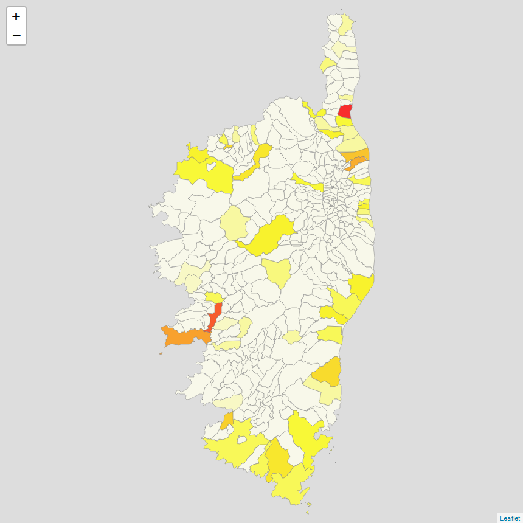</a>

<br>
<br>

## 7) indic.prop

<br>
<strong>
Taux de logements occupés par leur propriétaire (Source : RP) 
</strong>

<span style="color:green"><strong>
Données mises à jour (2019).
Le précédent indicateur a été construit à partir de la base FILOCOM 2017. Cependant certaines valeurs semble erronées.
D'autre part, dans la base FILOCOM 2019 certaines valeurs trop faibles ont été secrétisées.    
Ainsi, il a été choisi de construire ce nouvel indicateur à partir du recensement de population INSEE de 2019. 
</strong>
</span>


```{r, incude=F, echo=F, eval=F}
indic=Indicateurs_parCommune %>% select(CODGEO,indic=indic.prop)
carteCommunesCorses_indic_sf=left_join(carteCommunesCorses_sf, indic, by = "CODGEO")

palette <- colorBin(palette = rev(heat.colors(30)), domain = carteCommunesCorses_indic_sf$indic, bins=30)
palette_continue <- colorNumeric(palette = rev(heat.colors(30)), domain = range(carteCommunesCorses_indic_sf$indic))


carte_indic = leaflet(carteCommunesCorses_indic_sf) %>%
  addPolygons(fillColor = ~palette(indic),
              fillOpacity = 0.8,
              color = "gray",
              weight = 1, popup = ~paste("<strong>Commune:</strong>", carteCommunesCorses_indic_sf$LIBGEO, "<br>",
                   "<strong>Valeur:</strong>", carteCommunesCorses_indic_sf$indic)) 
# carte_indic = carte_indic %>%
#   addLegend(position = "topleft",
#             pal = palette_continue,
#             values = ~indic,
#             opacity = 1, bins=2)

widget_file7 <- "Cartes_Interactives/carte_interactive_7.html"
saveWidget(carte_indic, file = widget_file7)
webshot("Cartes_Interactives/carte_interactive_7.html", file = "Cartes_Interactives/carte7.png",vwidth = 860, vheight = 860)
```

<br>
*Cliquer sur l'image pour afficher la carte interactive*
<a href="Cartes_Interactives/carte_interactive_7.html" target="_blank">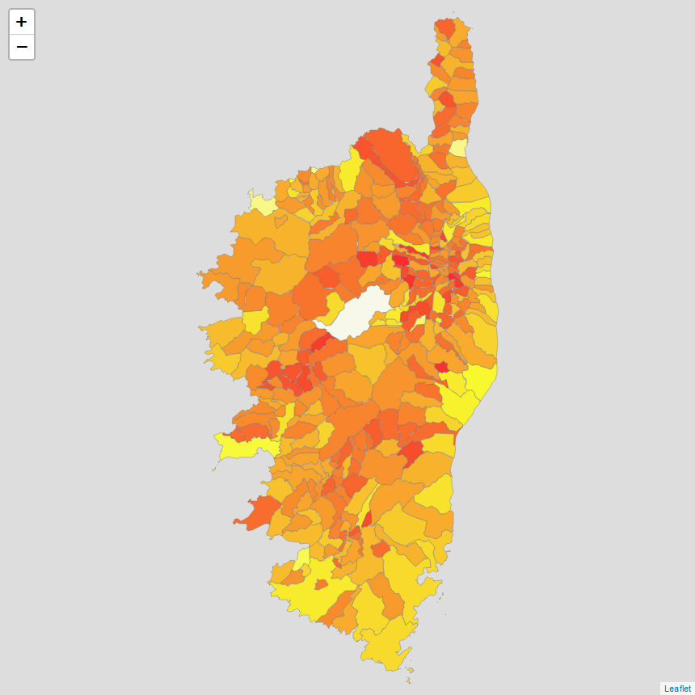</a>

<br>
<br>

## 8) indic.duroc

<br>
<strong>
Durée d’occupation médiane des logements (Source : FILOCOM)
</strong>

<span style="color:green"><strong>
Données mises à jour (2019). 
Attention : certaines valeurs trop faibles ont été secrétisées dans la base de données FILOCOM de 2019.  
Ces données ont été remplacées par les données de l'étude initiale (2017).
</strong>
</span>

```{r, incude=F, echo=F, eval=F}
indic=Indicateurs_parCommune %>% select(CODGEO,indic=indic.duroc)
carteCommunesCorses_indic_sf=left_join(carteCommunesCorses_sf, indic, by = "CODGEO")

palette <- colorBin(palette = rev(heat.colors(30)), domain = carteCommunesCorses_indic_sf$indic, bins=30)
palette_continue <- colorNumeric(palette = rev(heat.colors(30)), domain = range(carteCommunesCorses_indic_sf$indic))


carte_indic = leaflet(carteCommunesCorses_indic_sf) %>%
  addPolygons(fillColor = ~palette(indic),
              fillOpacity = 0.8,
              color = "gray",
              weight = 1, popup = ~paste("<strong>Commune:</strong>", carteCommunesCorses_indic_sf$LIBGEO, "<br>",
                   "<strong>Valeur:</strong>", carteCommunesCorses_indic_sf$indic))

# carte_indic = carte_indic %>%
#   addLegend(position = "topleft",
#             pal = palette_continue,
#             values = ~indic,
#             opacity = 1, bins=2)

widget_file8 <- "Cartes_Interactives/carte_interactive_8.html"
saveWidget(carte_indic, file = widget_file8)
webshot("Cartes_Interactives/carte_interactive_8.html", file = "Cartes_Interactives/carte8.png",vwidth = 860, vheight = 860)
```

<br>
*Cliquer sur l'image pour afficher la carte interactive*
<a href="Cartes_Interactives/carte_interactive_8.html" target="_blank">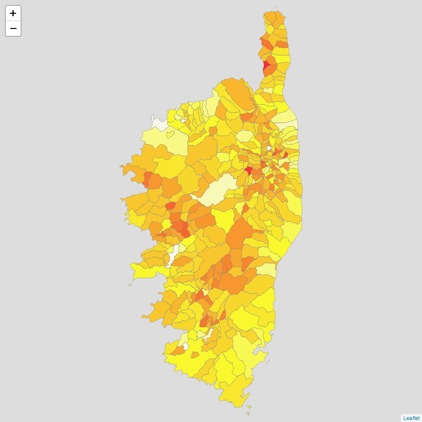</a>

<br>
<br>

## 9) indic.prix

<br>
<strong>
Prix du mètre carré rapporté au revenu fiscal médian communal (Source : DV3F, FILOCOM)
</strong>

<span style="color:green"><strong>
Données mises à jour (FILOCOM 2019 et DV3F 2018 - 2021).  
Le précédent indicateur portait sur le prix au mètre carré dans l'ancien, la mise à jour intègre également le neuf.
</strong>
</span>

```{r, incude=F, echo=F, eval=F}
indic=Indicateurs_parCommune %>% select(CODGEO,indic=indic.prix)
carteCommunesCorses_indic_sf=left_join(carteCommunesCorses_sf, indic, by = "CODGEO")

palette <- colorBin(palette = rev(heat.colors(30)), domain = carteCommunesCorses_indic_sf$indic, bins=30)
palette_continue <- colorNumeric(palette = rev(heat.colors(30)), domain = range(carteCommunesCorses_indic_sf$indic))


carte_indic = leaflet(carteCommunesCorses_indic_sf) %>%
  addPolygons(fillColor = ~palette(indic),
              fillOpacity = 0.8,
              color = "gray",
              weight = 1, popup = ~paste("<strong>Commune:</strong>", carteCommunesCorses_indic_sf$LIBGEO, "<br>",
                   "<strong>Valeur:</strong>", carteCommunesCorses_indic_sf$indic))

# carte_indic = carte_indic %>%
#   addLegend(position = "topleft",
#             pal = palette_continue,
#             values = ~indic,
#             opacity = 1, bins=2)

widget_file9 <- "Cartes_Interactives/carte_interactive_9.html"
saveWidget(carte_indic, file = widget_file9)
webshot("Cartes_Interactives/carte_interactive_9.html", file = "Cartes_Interactives/carte9.png",vwidth = 860, vheight = 860)
```

<br>
*Cliquer sur l'image pour afficher la carte interactive*
<a href="Cartes_Interactives/carte_interactive_9.html" target="_blank">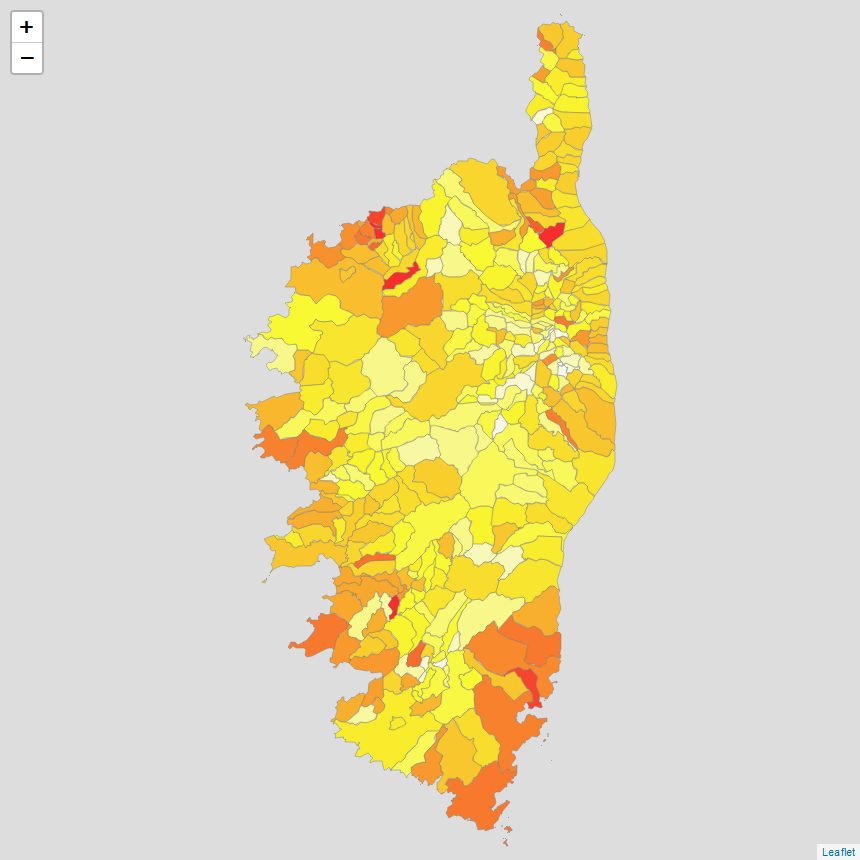</a>

<br>
<br>

## 10) indic.airbnb.nb_lgmt

<br>
<strong>
Taux de locations touristiques de courte durée rapporté au parc de logements communal (Source : INSEE-RP, AirDNA)
</strong>

<span style="color:green"><strong>
Données mises à jour (2022).
</strong>
</span>

```{r, incude=F, echo=F, eval=F}
indic=Indicateurs_parCommune %>% select(CODGEO,indic=indic.airbnb.nb_lgmt)
carteCommunesCorses_indic_sf=left_join(carteCommunesCorses_sf, indic, by = "CODGEO")

palette <- colorBin(palette = rev(heat.colors(30)), domain = carteCommunesCorses_indic_sf$indic, bins=30)
palette_continue <- colorNumeric(palette = rev(heat.colors(30)), domain = range(carteCommunesCorses_indic_sf$indic))


carte_indic = leaflet(carteCommunesCorses_indic_sf) %>%
  addPolygons(fillColor = ~palette(indic),
              fillOpacity = 0.8,
              color = "gray",
              weight = 1, popup = ~paste("<strong>Commune:</strong>", carteCommunesCorses_indic_sf$LIBGEO, "<br>",
                   "<strong>Valeur:</strong>", carteCommunesCorses_indic_sf$indic))

# carte_indic = carte_indic %>%
#   addLegend(position = "topleft",
#             pal = palette_continue,
#             values = ~indic,
#             opacity = 1, bins=2)

widget_file10 <- "Cartes_Interactives/carte_interactive_10.html"
saveWidget(carte_indic, file = widget_file10)
webshot("Cartes_Interactives/carte_interactive_10.html", file = "Cartes_Interactives/carte10.png",vwidth = 860, vheight = 860)
```

<br>
*Cliquer sur l'image pour afficher la carte interactive*
<a href="Cartes_Interactives/carte_interactive_10.html" target="_blank">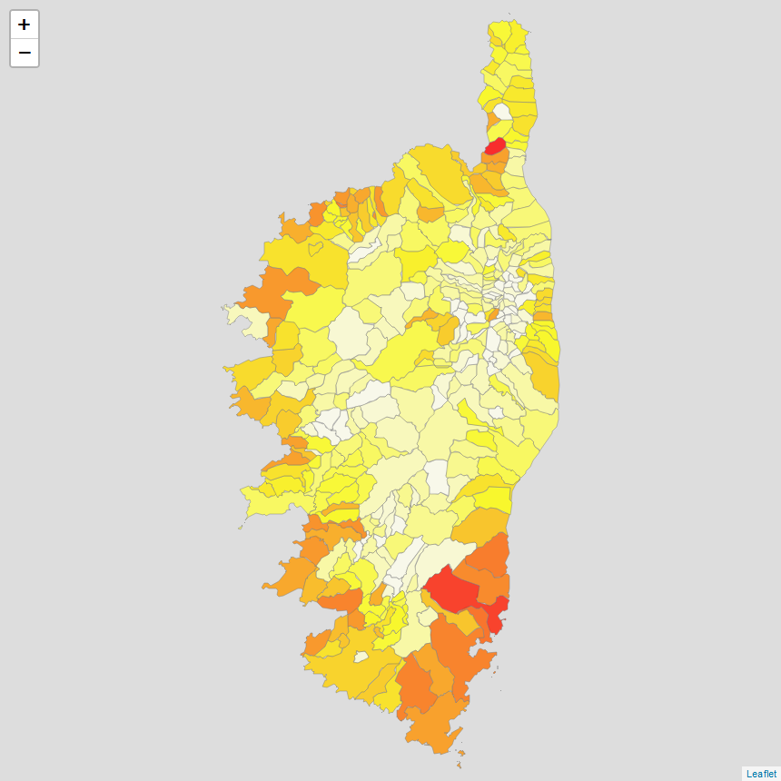</a>

<br>
<br>


## 11) indic.airbnb.revTot_annee

<br>
<strong>
Revenu total généré par les locations touristiques de courte duréee (Source : AirDNA)
</strong>

<span style="color:green"><strong>
Nouvel indicateur qui peut être intégré dans les simulations à venir.
</strong>
</span>

```{r, incude=F, echo=F, eval=F}
indic=Indicateurs_parCommune %>% select(CODGEO,indic=indic.airbnb.revTot_annee)
carteCommunesCorses_indic_sf=left_join(carteCommunesCorses_sf, indic, by = "CODGEO")

palette <- colorBin(palette = rev(heat.colors(30)), domain = carteCommunesCorses_indic_sf$indic, bins=30)
palette_continue <- colorNumeric(palette = rev(heat.colors(30)), domain = range(carteCommunesCorses_indic_sf$indic))


carte_indic = leaflet(carteCommunesCorses_indic_sf) %>%
  addPolygons(fillColor = ~palette(indic),
              fillOpacity = 0.8,
              color = "gray",
              weight = 1, popup = ~paste("<strong>Commune:</strong>", carteCommunesCorses_indic_sf$LIBGEO, "<br>",
                   "<strong>Valeur:</strong>", carteCommunesCorses_indic_sf$indic))

# carte_indic = carte_indic %>%
#   addLegend(position = "topleft",
#             pal = palette_continue,
#             values = ~indic,
#             opacity = 1, bins=2)

widget_file11 <- "Cartes_Interactives/carte_interactive_11.html"
saveWidget(carte_indic, file = widget_file11)
webshot("Cartes_Interactives/carte_interactive_11.html", file = "Cartes_Interactives/carte11.png",vwidth = 860, vheight = 860)
```

<br>
*Cliquer sur l'image pour afficher la carte interactive*
<a href="Cartes_Interactives/carte_interactive_11.html" target="_blank">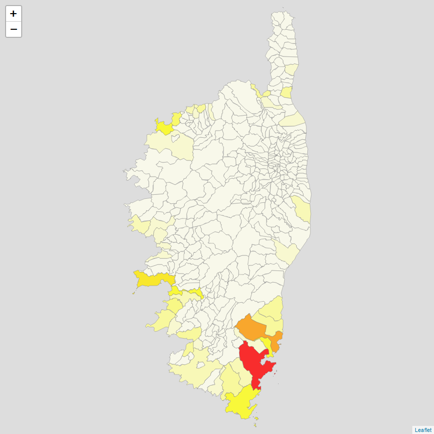</a>

<br>
<br>


## 12) indic.airbnb.revMoy_lgt

<br>
<strong>
Revenu moyen par logement des locations touristiques de courte duréee (Source : AirDNA)
</strong>

<span style="color:green"><strong>
Nouvel indicateur qui peut être intégré dans les simulations à venir.
</strong>
</span>

```{r, incude=F, echo=F, eval=F}
indic=Indicateurs_parCommune %>% select(CODGEO,indic=indic.airbnb.revMoy_lgt)
carteCommunesCorses_indic_sf=left_join(carteCommunesCorses_sf, indic, by = "CODGEO")

palette <- colorBin(palette = rev(heat.colors(30)), domain = carteCommunesCorses_indic_sf$indic, bins=30)
palette_continue <- colorNumeric(palette = rev(heat.colors(30)), domain = range(carteCommunesCorses_indic_sf$indic))


carte_indic = leaflet(carteCommunesCorses_indic_sf) %>%
  addPolygons(fillColor = ~palette(indic),
              fillOpacity = 0.8,
              color = "gray",
              weight = 1, popup = ~paste("<strong>Commune:</strong>", carteCommunesCorses_indic_sf$LIBGEO, "<br>",
                   "<strong>Valeur:</strong>", carteCommunesCorses_indic_sf$indic))

# carte_indic = carte_indic %>%
#   addLegend(position = "topleft",
#             pal = palette_continue,
#             values = ~indic,
#             opacity = 1, bins=2)

widget_file12 <- "Cartes_Interactives/carte_interactive_12.html"
saveWidget(carte_indic, file = widget_file12)
webshot("Cartes_Interactives/carte_interactive_12.html", file = "Cartes_Interactives/carte12.png",vwidth = 860, vheight = 860)
```

<br>
*Cliquer sur l'image pour afficher la carte interactive*
<a href="Cartes_Interactives/carte_interactive_12.html" target="_blank">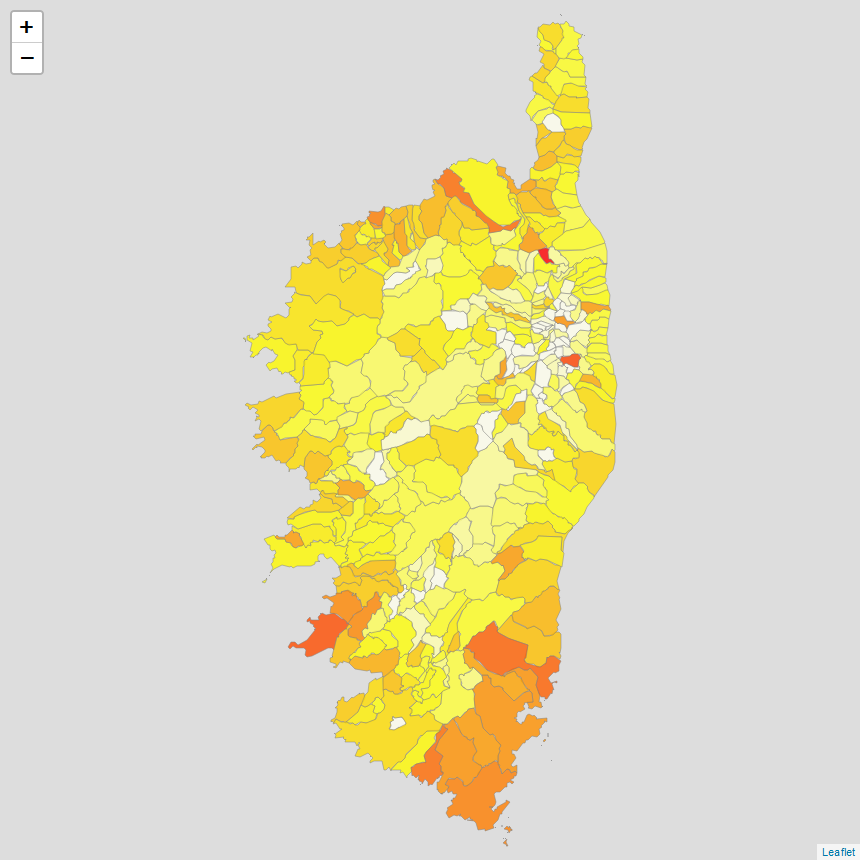</a>

<br>
<br>


## 13) indic.log

<br>
<strong>
Nombre de logements (Source : INSEE, RP)
</strong>

<span style="color:green"><strong>
Nouvel indicateur qui peut être intégré dans les simulations à venir.
</strong>
</span>

```{r, incude=F, echo=F, eval=F}
indic=Indicateurs_parCommune %>% select(CODGEO,indic=indic.log)
carteCommunesCorses_indic_sf=left_join(carteCommunesCorses_sf, indic, by = "CODGEO")

palette <- colorBin(palette = rev(heat.colors(30)), domain = carteCommunesCorses_indic_sf$indic, bins=30)
palette_continue <- colorNumeric(palette = rev(heat.colors(30)), domain = range(carteCommunesCorses_indic_sf$indic))


carte_indic = leaflet(carteCommunesCorses_indic_sf) %>%
  addPolygons(fillColor = ~palette(indic),
              fillOpacity = 0.8,
              color = "gray",
              weight = 1, popup = ~paste("<strong>Commune:</strong>", carteCommunesCorses_indic_sf$LIBGEO, "<br>",
                   "<strong>Valeur:</strong>", carteCommunesCorses_indic_sf$indic))

# carte_indic = carte_indic %>%
#   addLegend(position = "topleft",
#             pal = palette_continue,
#             values = ~indic,
#             opacity = 1, bins=2)

widget_file13 <- "Cartes_Interactives/carte_interactive_13.html"
saveWidget(carte_indic, file = widget_file13)
webshot("Cartes_Interactives/carte_interactive_13.html", file = "Cartes_Interactives/carte13.png",vwidth = 860, vheight = 860)
```

<br>
*Cliquer sur l'image pour afficher la carte interactive*
<a href="Cartes_Interactives/carte_interactive_13.html" target="_blank">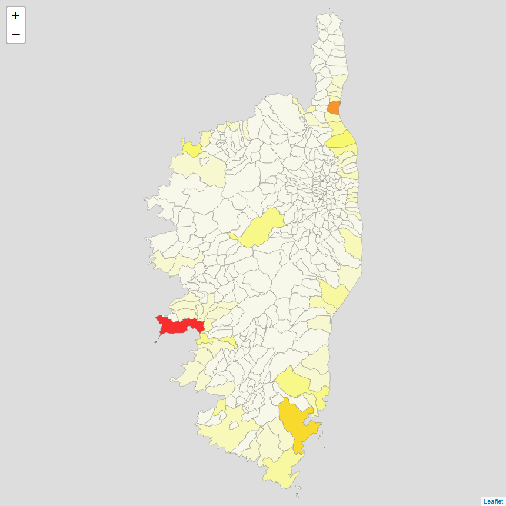</a>

<br>
<br>
<br>
<br>


# Resultats avec les données mises à jour

<br>
On conserve exactement la même méthodologie que dans l'étude initiale.  
Dans la 1^ère^ simulation 1.1), on met seulement à jour les données.  
Dans la 2^ème^ simulation 1.2) on ajoute en plus l'indicateur sur le revenu total des location de courte durée.  
Dans la 3^ème^ simulation 1.3) on utilise l'indicateur de revenu moyen par logement des locations de coute durée (à la place du revenu total).  
<br>
Les 3 simulations suivantes sont les mêmes en ajoutant en plus le nombre de logements dans la liste des indicateurs.  

<br>


## 1) Sans l'indicateur "nombre de logements"

<br>

###  1.1) Mêmes données mises à jour

```{r , include=FALSE, eval=F}
rm(list=ls())


nb_mailles=36
population_min=2500

load("Données/Donnees_Logement_MAJ.Rdata")
Donnees_Logement=Donnees_Logement_MAJ
Import_carteCommunesCorses=st_read("Données/SHP_COMMUNES/COMMUNE.shp")
carteCommunesCorses=Import_carteCommunesCorses %>% select(INSEE_COM,geometry)
colnames(carteCommunesCorses)[1]="CODGEO"
carteCommunesCorses=carteCommunesCorses %>% arrange(CODGEO)
carteCommunesCorses <- st_transform(carteCommunesCorses, crs = 4326)

Indicateurs_parCommune= Donnees_Logement %>% 
  mutate(indic.transac = round(100 * nb_mut / LOG, 1),
         indic.menag = round(POP/RP, 1),
         indic.rs = round(100 * RSECOCC / LOG, 1),
         indic.lv = round(100 * LOGVAC / LOG, 1),
         indic.jeun = round(jeun / anc, 1),
         indic.social = round(100 * social / tot_lgmt, 1),
         indic.prop = round(100 * proprietaire / RP, 1),
         indic.duroc = duroc,
         indic.prix = round(100 * moyenne_prix/rev_ucm, 1),
         indic.airbnb.nb_lgmt=round(100*Loc.actives/LOG, 1)) %>% 
  select(CODGEO,LIBGEO,POP,LOG,contains("indic"))
Indicateurs_parCommune=Indicateurs_parCommune %>% mutate_if(is.numeric, funs(ifelse(is.na(.), 0, .)))


winsorisation= function (x, prob.min = 0.01, prob.max = .99){
  a <- quantile(x, probs = c(prob.min, prob.max))
  x[x > a[2]] <- a[2]
  x[x < a[1]] <- a[1]
  return(x)
}
listeIndicateurs=Indicateurs_parCommune %>% select(contains("indic")) %>% names()
Indicateurs_parCommune[listeIndicateurs]=apply(Indicateurs_parCommune[listeIndicateurs],MARGIN = 2, FUN = winsorisation)
Indicateurs_parCommune_valeurs=Indicateurs_parCommune[listeIndicateurs] 
carteCommunesCorses_spdf=carteCommunesCorses %>% left_join(Indicateurs_parCommune,by="CODGEO")%>% select(CODGEO,LIBGEO,POP) %>%  as("Spatial")
table_voisinage=poly2nb(carteCommunesCorses_spdf,queen=F)
ACP_parCommunes <- Indicateurs_parCommune_valeurs %>%  PCA(graph = F)
nb_dim <- which(ACP_parCommunes$eig[, 3] > 80)[1] 
ACP_parCommunes <- Indicateurs_parCommune_valeurs %>%  PCA(graph = F,ncp = nb_dim)
donnees_pondérations=ACP_parCommunes$ind$coord
pondérations=nbcosts(table_voisinage, data = donnees_pondérations)
table_voisinage_pondérée=nb2listw(table_voisinage, glist = pondérations, style = "C")
arbre_poids_minimal <- mstree(table_voisinage_pondérée)

resultat_skater=skater(edges = arbre_poids_minimal[,1:2],data=donnees_pondérations,ncuts=nb_mailles-1,crit=population_min,vec.crit=Donnees_Logement$POP)

carteMailles=carteCommunesCorses %>% mutate(maille=resultat_skater$groups) %>%  group_by(maille) %>%  summarise(geometry = st_union(geometry))

Maillage=data.frame(CODGEO=Indicateurs_parCommune$CODGEO,maille=resultat_skater$groups)

Indicateurs_parMaille=Maillage %>% 
  left_join(Donnees_Logement, by="CODGEO") %>% 
  group_by(maille) %>% 
  summarise_if(is.numeric, funs(sum(., na.rm = TRUE))) %>% 
  mutate(indic.transac = round(100 * nb_mut / LOG, 1),
         indic.menag = round(POP/RP, 1),
         indic.rs = round(100 * RSECOCC / LOG, 1),
         indic.lv = round(100 * LOGVAC / LOG, 1),
         indic.jeun = round(jeun / anc, 1),
         indic.social = round(100 * social / tot_lgmt, 1),
         indic.prop = round(100 * proprietaire / tot_lgmt, 1),
         indic.duroc = duroc,
         indic.prix = round(100 * moyenne_prix/rev_ucm, 1),
         indic.airbnb=round(100*Loc.actives/LOG, 1),
         indic.airbnb.nb_lgmt=round(100*Loc.actives/LOG, 1)) %>% 
  select(maille,POP,LOG,contains("indic")) %>% 
  mutate_if(is.numeric, funs(ifelse(is.na(.), 0, .)))


Indicateurs_parMaille_valeurs=Indicateurs_parMaille %>% select(contains("indic"))
Indicateurs_parMaille_valeurs=Indicateurs_parMaille_valeurs %>% apply(MARGIN = 2, FUN = winsorisation)
acp_parMailles=PCA(Indicateurs_parMaille_valeurs,ncp=5,graph=F)
hc4 <- HCPC(acp_parMailles, nb.clust = 4, consol = T, graph = F)
cl4 <- data.frame(maille = Indicateurs_parMaille$maille, cl_maille4 = hc4$data.clust[,"clust"])
carteMaillesSecteurs <- left_join(carteMailles, cl4, by = "maille")

carteCommunesCorses_merged <- left_join(carteCommunesCorses, Donnees_Logement, by = "CODGEO")
carteCommunesCorses_sf <- st_as_sf(carteCommunesCorses_merged)


# Création d'une palette de couleurs pour les secteurs
palSecteurs = colorFactor(palette = c("seagreen3", "orange2","blueviolet", "deeppink"), domain = carteMaillesSecteurs$cl_maille4)

palSecteurs = colorFactor(palette = c("deeppink", "blueviolet","seagreen3", "orange2"), domain = carteMaillesSecteurs$cl_maille4)


# Création d'une carte des communes avec un trait gris fin
carteCommunes = leaflet(carteCommunesCorses_sf) %>%
  addPolygons(fillColor = "white",
              fillOpacity = 0.8,
              color = "gray",
              weight = 1)

# Ajout des mailles avec un trait noir plus épais et colorées selon le secteur
carte_MAJ=carteCommunes %>%
  addPolygons(data = carteMaillesSecteurs,
              fillColor = ~palSecteurs(cl_maille4),
              fillOpacity = 0.8,
              color = "black",
              weight = 2)

widget_fileMAJ1 <- "Cartes_Interactives/carte_interactive_MAJ1.html"
saveWidget(carte_MAJ, file = widget_fileMAJ1)
webshot("Cartes_Interactives/carte_interactive_MAJ1.html", file = "Cartes_Interactives/carteMAJ1.png",vwidth = 860, vheight = 860)
```

<br>
*Cliquer sur l'image pour afficher la carte interactive*
<a href="Cartes_Interactives/carte_interactive_MAJ1.html" target="_blank">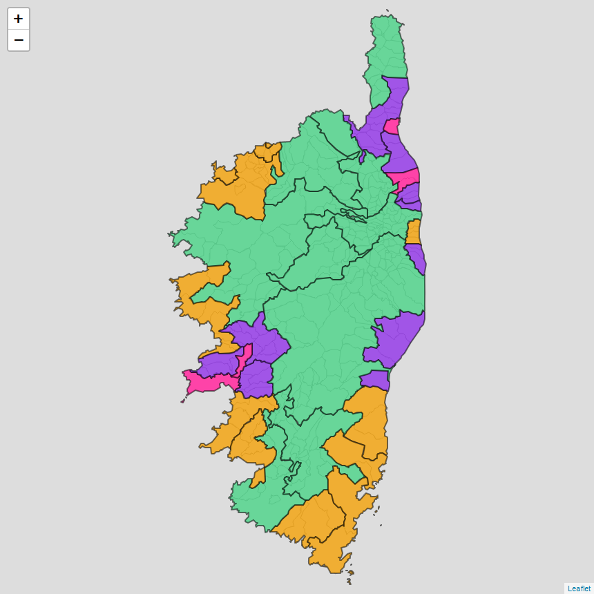</a>

<br>
<br>
<br>

###  1.2) Ajout du "revenu total Airbnb" + MAJ données 

```{r , include=FALSE, eval=F}
rm(list=ls())


nb_mailles=36
population_min=2500

load("Données/Donnees_Logement_MAJ.Rdata")
Donnees_Logement=Donnees_Logement_MAJ
Import_carteCommunesCorses=st_read("Données/SHP_COMMUNES/COMMUNE.shp")
carteCommunesCorses=Import_carteCommunesCorses %>% select(INSEE_COM,geometry)
colnames(carteCommunesCorses)[1]="CODGEO"
carteCommunesCorses=carteCommunesCorses %>% arrange(CODGEO)
carteCommunesCorses <- st_transform(carteCommunesCorses, crs = 4326)

Indicateurs_parCommune= Donnees_Logement %>% 
  mutate(indic.transac = round(100 * nb_mut / LOG, 1),
         indic.menag = round(POP/RP, 1),
         indic.rs = round(100 * RSECOCC / LOG, 1),
         indic.lv = round(100 * LOGVAC / LOG, 1),
         indic.jeun = round(jeun / anc, 1),
         indic.social = round(100 * social / tot_lgmt, 1),
         indic.prop = round(100 * proprietaire / RP, 1),
         indic.duroc = duroc,
         indic.prix = round(100 * moyenne_prix/rev_ucm, 1),
         indic.airbnb.nb_lgmt=round(100*Loc.actives/LOG, 1),
         indic.airbnb.revTot_annee=rev.LTM_tot) %>% 
  select(CODGEO,LIBGEO,POP,LOG,contains("indic"))
Indicateurs_parCommune=Indicateurs_parCommune %>% mutate_if(is.numeric, funs(ifelse(is.na(.), 0, .)))


winsorisation= function (x, prob.min = 0.01, prob.max = .99){
  a <- quantile(x, probs = c(prob.min, prob.max))
  x[x > a[2]] <- a[2]
  x[x < a[1]] <- a[1]
  return(x)
}
listeIndicateurs=Indicateurs_parCommune %>% select(contains("indic")) %>% names()
Indicateurs_parCommune[listeIndicateurs]=apply(Indicateurs_parCommune[listeIndicateurs],MARGIN = 2, FUN = winsorisation)
Indicateurs_parCommune_valeurs=Indicateurs_parCommune[listeIndicateurs] 
carteCommunesCorses_spdf=carteCommunesCorses %>% left_join(Indicateurs_parCommune,by="CODGEO")%>% select(CODGEO,LIBGEO,POP) %>%  as("Spatial")
table_voisinage=poly2nb(carteCommunesCorses_spdf,queen=F)
ACP_parCommunes <- Indicateurs_parCommune_valeurs %>%  PCA(graph = F)
nb_dim <- which(ACP_parCommunes$eig[, 3] > 80)[1] 
ACP_parCommunes <- Indicateurs_parCommune_valeurs %>%  PCA(graph = F,ncp = nb_dim)
donnees_pondérations=ACP_parCommunes$ind$coord
pondérations=nbcosts(table_voisinage, data = donnees_pondérations)
table_voisinage_pondérée=nb2listw(table_voisinage, glist = pondérations, style = "C")
arbre_poids_minimal <- mstree(table_voisinage_pondérée)

resultat_skater=skater(edges = arbre_poids_minimal[,1:2],data=donnees_pondérations,ncuts=nb_mailles-1,crit=population_min,vec.crit=Donnees_Logement$POP)

carteMailles=carteCommunesCorses %>% mutate(maille=resultat_skater$groups) %>%  group_by(maille) %>%  summarise(geometry = st_union(geometry))

Maillage=data.frame(CODGEO=Indicateurs_parCommune$CODGEO,maille=resultat_skater$groups)

Indicateurs_parMaille=Maillage %>% 
  left_join(Donnees_Logement, by="CODGEO") %>% 
  group_by(maille) %>% 
  summarise_if(is.numeric, funs(sum(., na.rm = TRUE))) %>% 
  mutate(indic.transac = round(100 * nb_mut / LOG, 1),
         indic.menag = round(POP/RP, 1),
         indic.rs = round(100 * RSECOCC / LOG, 1),
         indic.lv = round(100 * LOGVAC / LOG, 1),
         indic.jeun = round(jeun / anc, 1),
         indic.social = round(100 * social / tot_lgmt, 1),
         indic.prop = round(100 * proprietaire / tot_lgmt, 1),
         indic.duroc = duroc,
         indic.prix = round(100 * moyenne_prix/rev_ucm, 1),
         indic.airbnb=round(100*Loc.actives/LOG, 1),
         indic.airbnb.nb_lgmt=round(100*Loc.actives/LOG, 1),
         indic.airbnb.revTot_annee=rev.LTM_tot) %>% 
  select(maille,POP,LOG,contains("indic")) %>% 
  mutate_if(is.numeric, funs(ifelse(is.na(.), 0, .)))


Indicateurs_parMaille_valeurs=Indicateurs_parMaille %>% select(contains("indic"))
Indicateurs_parMaille_valeurs=Indicateurs_parMaille_valeurs %>% apply(MARGIN = 2, FUN = winsorisation)
acp_parMailles=PCA(Indicateurs_parMaille_valeurs,ncp=5,graph=F)
hc4 <- HCPC(acp_parMailles, nb.clust = 4, consol = T, graph = F)
cl4 <- data.frame(maille = Indicateurs_parMaille$maille, cl_maille4 = hc4$data.clust[,"clust"])
carteMaillesSecteurs <- left_join(carteMailles, cl4, by = "maille")

carteCommunesCorses_merged <- left_join(carteCommunesCorses, Donnees_Logement, by = "CODGEO")
carteCommunesCorses_sf <- st_as_sf(carteCommunesCorses_merged)


# Création d'une palette de couleurs pour les secteurs
palSecteurs = colorFactor(palette = c("seagreen3", "orange2","blueviolet", "deeppink"), domain = carteMaillesSecteurs$cl_maille4)
palSecteurs = colorFactor(palette = c("deeppink", "blueviolet","seagreen3", "orange2"), domain = carteMaillesSecteurs$cl_maille4)

# Création d'une carte des communes avec un trait gris fin
carteCommunes = leaflet(carteCommunesCorses_sf) %>%
  addPolygons(fillColor = "white",
              fillOpacity = 0.8,
              color = "gray",
              weight = 1)

# Ajout des mailles avec un trait noir plus épais et colorées selon le secteur
carte_MAJ=carteCommunes %>%
  addPolygons(data = carteMaillesSecteurs,
              fillColor = ~palSecteurs(cl_maille4),
              fillOpacity = 0.8,
              color = "black",
              weight = 2)

widget_fileMAJ2 <- "Cartes_Interactives/carte_interactive_MAJ2.html"
saveWidget(carte_MAJ, file = widget_fileMAJ2)
webshot("Cartes_Interactives/carte_interactive_MAJ2.html", file = "Cartes_Interactives/carteMAJ2.png",vwidth = 860, vheight = 860)
```

<br>
*Cliquer sur l'image pour afficher la carte interactive*
<a href="Cartes_Interactives/carte_interactive_MAJ2.html" target="_blank">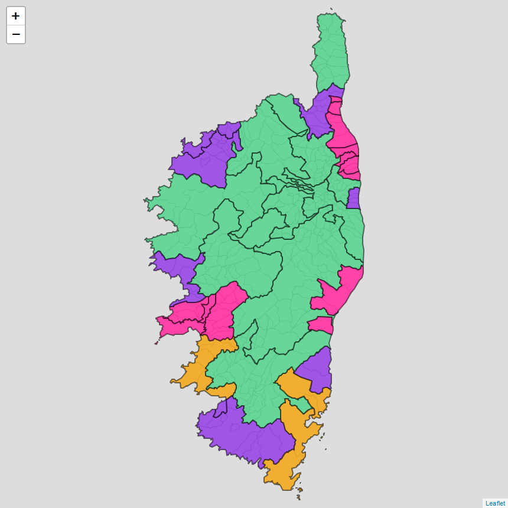</a>

<br>
<br>
<br>

###  1.3) Ajout du "revenu moyen / logement Airbnb" + MAJ données 

```{r , include=FALSE, eval=F}
rm(list=ls())


nb_mailles=36
population_min=2500

load("Données/Donnees_Logement_MAJ.Rdata")
Donnees_Logement=Donnees_Logement_MAJ
Import_carteCommunesCorses=st_read("Données/SHP_COMMUNES/COMMUNE.shp")
carteCommunesCorses=Import_carteCommunesCorses %>% select(INSEE_COM,geometry)
colnames(carteCommunesCorses)[1]="CODGEO"
carteCommunesCorses=carteCommunesCorses %>% arrange(CODGEO)
carteCommunesCorses <- st_transform(carteCommunesCorses, crs = 4326)

Indicateurs_parCommune= Donnees_Logement %>% 
  mutate(indic.transac = round(100 * nb_mut / LOG, 1),
         indic.menag = round(POP/RP, 1),
         indic.rs = round(100 * RSECOCC / LOG, 1),
         indic.lv = round(100 * LOGVAC / LOG, 1),
         indic.jeun = round(jeun / anc, 1),
         indic.social = round(100 * social / tot_lgmt, 1),
         indic.prop = round(100 * proprietaire / RP, 1),
         indic.duroc = duroc,
         indic.prix = round(100 * moyenne_prix/rev_ucm, 1),
         indic.airbnb.nb_lgmt=round(100*Loc.actives/LOG, 1),
         indic.airbnb.revMoy_lgt=rev.LTM_moy_lgt) %>% 
  select(CODGEO,LIBGEO,POP,LOG,contains("indic"))
Indicateurs_parCommune=Indicateurs_parCommune %>% mutate_if(is.numeric, funs(ifelse(is.na(.), 0, .)))


winsorisation= function (x, prob.min = 0.01, prob.max = .99){
  a <- quantile(x, probs = c(prob.min, prob.max))
  x[x > a[2]] <- a[2]
  x[x < a[1]] <- a[1]
  return(x)
}
listeIndicateurs=Indicateurs_parCommune %>% select(contains("indic")) %>% names()
Indicateurs_parCommune[listeIndicateurs]=apply(Indicateurs_parCommune[listeIndicateurs],MARGIN = 2, FUN = winsorisation)
Indicateurs_parCommune_valeurs=Indicateurs_parCommune[listeIndicateurs] 
carteCommunesCorses_spdf=carteCommunesCorses %>% left_join(Indicateurs_parCommune,by="CODGEO")%>% select(CODGEO,LIBGEO,POP) %>%  as("Spatial")
table_voisinage=poly2nb(carteCommunesCorses_spdf,queen=F)
ACP_parCommunes <- Indicateurs_parCommune_valeurs %>%  PCA(graph = F)
nb_dim <- which(ACP_parCommunes$eig[, 3] > 80)[1] 
ACP_parCommunes <- Indicateurs_parCommune_valeurs %>%  PCA(graph = F,ncp = nb_dim)
donnees_pondérations=ACP_parCommunes$ind$coord
pondérations=nbcosts(table_voisinage, data = donnees_pondérations)
table_voisinage_pondérée=nb2listw(table_voisinage, glist = pondérations, style = "C")
arbre_poids_minimal <- mstree(table_voisinage_pondérée)

resultat_skater=skater(edges = arbre_poids_minimal[,1:2],data=donnees_pondérations,ncuts=nb_mailles-1,crit=population_min,vec.crit=Donnees_Logement$POP)

carteMailles=carteCommunesCorses %>% mutate(maille=resultat_skater$groups) %>%  group_by(maille) %>%  summarise(geometry = st_union(geometry))

Maillage=data.frame(CODGEO=Indicateurs_parCommune$CODGEO,maille=resultat_skater$groups)

Indicateurs_parMaille=Maillage %>% 
  left_join(Donnees_Logement, by="CODGEO") %>% 
  group_by(maille) %>% 
  summarise_if(is.numeric, funs(sum(., na.rm = TRUE))) %>% 
  mutate(indic.transac = round(100 * nb_mut / LOG, 1),
         indic.menag = round(POP/RP, 1),
         indic.rs = round(100 * RSECOCC / LOG, 1),
         indic.lv = round(100 * LOGVAC / LOG, 1),
         indic.jeun = round(jeun / anc, 1),
         indic.social = round(100 * social / tot_lgmt, 1),
         indic.prop = round(100 * proprietaire / tot_lgmt, 1),
         indic.duroc = duroc,
         indic.prix = round(100 * moyenne_prix/rev_ucm, 1),
         indic.airbnb=round(100*Loc.actives/LOG, 1),
         indic.airbnb.nb_lgmt=round(100*Loc.actives/LOG, 1),
         indic.airbnb.revMoy_lgt=rev.LTM_moy_lgt) %>% 
  select(maille,POP,LOG,contains("indic")) %>% 
  mutate_if(is.numeric, funs(ifelse(is.na(.), 0, .)))


Indicateurs_parMaille_valeurs=Indicateurs_parMaille %>% select(contains("indic"))
Indicateurs_parMaille_valeurs=Indicateurs_parMaille_valeurs %>% apply(MARGIN = 2, FUN = winsorisation)
acp_parMailles=PCA(Indicateurs_parMaille_valeurs,ncp=5,graph=F)
hc4 <- HCPC(acp_parMailles, nb.clust = 4, consol = T, graph = F)
cl4 <- data.frame(maille = Indicateurs_parMaille$maille, cl_maille4 = hc4$data.clust[,"clust"])
carteMaillesSecteurs <- left_join(carteMailles, cl4, by = "maille")

carteCommunesCorses_merged <- left_join(carteCommunesCorses, Donnees_Logement, by = "CODGEO")
carteCommunesCorses_sf <- st_as_sf(carteCommunesCorses_merged)


# Création d'une palette de couleurs pour les secteurs
palSecteurs = colorFactor(palette = c("seagreen3", "orange2","blueviolet", "deeppink"), domain = carteMaillesSecteurs$cl_maille4)

# Création d'une carte des communes avec un trait gris fin
carteCommunes = leaflet(carteCommunesCorses_sf) %>%
  addPolygons(fillColor = "white",
              fillOpacity = 0.8,
              color = "gray",
              weight = 1)

# Ajout des mailles avec un trait noir plus épais et colorées selon le secteur
carte_MAJ=carteCommunes %>%
  addPolygons(data = carteMaillesSecteurs,
              fillColor = ~palSecteurs(cl_maille4),
              fillOpacity = 0.8,
              color = "black",
              weight = 2)

widget_fileMAJ3 <- "Cartes_Interactives/carte_interactive_MAJ3.html"
saveWidget(carte_MAJ, file = widget_fileMAJ3)
webshot("Cartes_Interactives/carte_interactive_MAJ3.html", file = "Cartes_Interactives/carteMAJ3.png",vwidth = 860, vheight = 860)
```

<br>
*Cliquer sur l'image pour afficher la carte interactive*
<a href="Cartes_Interactives/carte_interactive_MAJ3.html" target="_blank">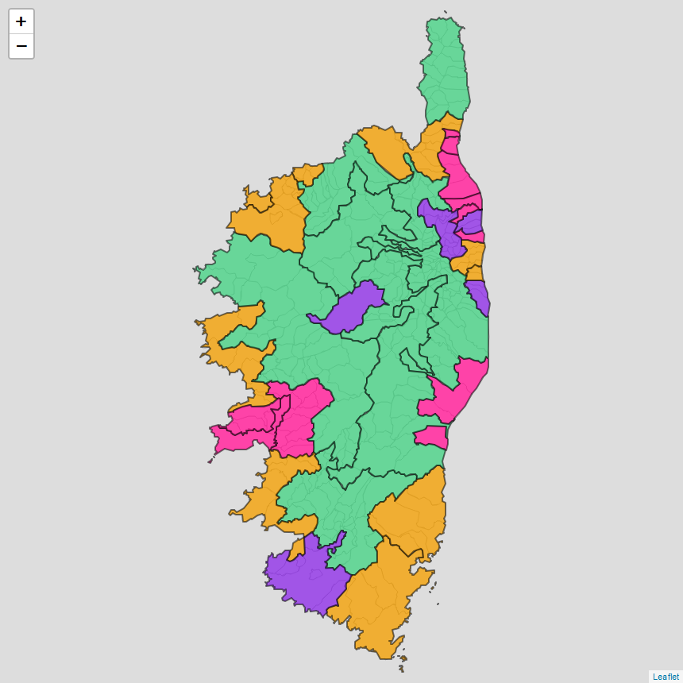</a>

<br>
<br>
<br> 
<br>
 
##  2) Avec l'ajout de l'indicateur "nombre de logements"

<br>

### 2.1) Ajout du "nombre de logements"

```{r , include=FALSE, eval=F}
rm(list=ls())


nb_mailles=36
population_min=2500

load("Données/Donnees_Logement_MAJ.Rdata")
Donnees_Logement=Donnees_Logement_MAJ
Import_carteCommunesCorses=st_read("Données/SHP_COMMUNES/COMMUNE.shp")
carteCommunesCorses=Import_carteCommunesCorses %>% select(INSEE_COM,geometry)
colnames(carteCommunesCorses)[1]="CODGEO"
carteCommunesCorses=carteCommunesCorses %>% arrange(CODGEO)
carteCommunesCorses <- st_transform(carteCommunesCorses, crs = 4326)

Indicateurs_parCommune= Donnees_Logement %>% 
  mutate(indic.transac = round(100 * nb_mut / LOG, 1),
         indic.menag = round(POP/RP, 1),
         indic.rs = round(100 * RSECOCC / LOG, 1),
         indic.lv = round(100 * LOGVAC / LOG, 1),
         indic.jeun = round(jeun / anc, 1),
         indic.social = round(100 * social / tot_lgmt, 1),
         indic.prop = round(100 * proprietaire / RP, 1),
         indic.duroc = duroc,
         indic.prix = round(100 * moyenne_prix/rev_ucm, 1),
         indic.airbnb.nb_lgmt=round(100*Loc.actives/LOG, 1),
         indic.log=LOG) %>% 
  select(CODGEO,LIBGEO,POP,LOG,contains("indic"))
Indicateurs_parCommune=Indicateurs_parCommune %>% mutate_if(is.numeric, funs(ifelse(is.na(.), 0, .)))


winsorisation= function (x, prob.min = 0.01, prob.max = .99){
  a <- quantile(x, probs = c(prob.min, prob.max))
  x[x > a[2]] <- a[2]
  x[x < a[1]] <- a[1]
  return(x)
}
listeIndicateurs=Indicateurs_parCommune %>% select(contains("indic")) %>% names()
Indicateurs_parCommune[listeIndicateurs]=apply(Indicateurs_parCommune[listeIndicateurs],MARGIN = 2, FUN = winsorisation)
Indicateurs_parCommune_valeurs=Indicateurs_parCommune[listeIndicateurs] 
carteCommunesCorses_spdf=carteCommunesCorses %>% left_join(Indicateurs_parCommune,by="CODGEO")%>% select(CODGEO,LIBGEO,POP) %>%  as("Spatial")
table_voisinage=poly2nb(carteCommunesCorses_spdf,queen=F)
ACP_parCommunes <- Indicateurs_parCommune_valeurs %>%  PCA(graph = F)
nb_dim <- which(ACP_parCommunes$eig[, 3] > 80)[1] 
ACP_parCommunes <- Indicateurs_parCommune_valeurs %>%  PCA(graph = F,ncp = nb_dim)
donnees_pondérations=ACP_parCommunes$ind$coord
pondérations=nbcosts(table_voisinage, data = donnees_pondérations)
table_voisinage_pondérée=nb2listw(table_voisinage, glist = pondérations, style = "C")
arbre_poids_minimal <- mstree(table_voisinage_pondérée)

resultat_skater=skater(edges = arbre_poids_minimal[,1:2],data=donnees_pondérations,ncuts=nb_mailles-1,crit=population_min,vec.crit=Donnees_Logement$POP)

carteMailles=carteCommunesCorses %>% mutate(maille=resultat_skater$groups) %>%  group_by(maille) %>%  summarise(geometry = st_union(geometry))

Maillage=data.frame(CODGEO=Indicateurs_parCommune$CODGEO,maille=resultat_skater$groups)

Indicateurs_parMaille=Maillage %>% 
  left_join(Donnees_Logement, by="CODGEO") %>% 
  group_by(maille) %>% 
  summarise_if(is.numeric, funs(sum(., na.rm = TRUE))) %>% 
  mutate(indic.transac = round(100 * nb_mut / LOG, 1),
         indic.menag = round(POP/RP, 1),
         indic.rs = round(100 * RSECOCC / LOG, 1),
         indic.lv = round(100 * LOGVAC / LOG, 1),
         indic.jeun = round(jeun / anc, 1),
         indic.social = round(100 * social / tot_lgmt, 1),
         indic.prop = round(100 * proprietaire / tot_lgmt, 1),
         indic.duroc = duroc,
         indic.prix = round(100 * moyenne_prix/rev_ucm, 1),
         indic.airbnb=round(100*Loc.actives/LOG, 1),
         indic.airbnb.nb_lgmt=round(100*Loc.actives/LOG, 1),
         indic.log=LOG) %>% 
  select(maille,POP,LOG,contains("indic")) %>% 
  mutate_if(is.numeric, funs(ifelse(is.na(.), 0, .)))


Indicateurs_parMaille_valeurs=Indicateurs_parMaille %>% select(contains("indic"))
Indicateurs_parMaille_valeurs=Indicateurs_parMaille_valeurs %>% apply(MARGIN = 2, FUN = winsorisation)
acp_parMailles=PCA(Indicateurs_parMaille_valeurs,ncp=5,graph=F)
hc4 <- HCPC(acp_parMailles, nb.clust = 4, consol = T, graph = F)
cl4 <- data.frame(maille = Indicateurs_parMaille$maille, cl_maille4 = hc4$data.clust[,"clust"])
carteMaillesSecteurs <- left_join(carteMailles, cl4, by = "maille")

carteCommunesCorses_merged <- left_join(carteCommunesCorses, Donnees_Logement, by = "CODGEO")
carteCommunesCorses_sf <- st_as_sf(carteCommunesCorses_merged)


# Création d'une palette de couleurs pour les secteurs
palSecteurs = colorFactor(palette = c("seagreen3", "orange2","blueviolet", "deeppink"), domain = carteMaillesSecteurs$cl_maille4)
palSecteurs = colorFactor(palette = c("deeppink", "blueviolet","seagreen3", "orange2"), domain = carteMaillesSecteurs$cl_maille4)


# Création d'une carte des communes avec un trait gris fin
carteCommunes = leaflet(carteCommunesCorses_sf) %>%
  addPolygons(fillColor = "white",
              fillOpacity = 0.8,
              color = "gray",
              weight = 1)

# Ajout des mailles avec un trait noir plus épais et colorées selon le secteur
carte_MAJ=carteCommunes %>%
  addPolygons(data = carteMaillesSecteurs,
              fillColor = ~palSecteurs(cl_maille4),
              fillOpacity = 0.8,
              color = "black",
              weight = 2)

widget_fileMAJ1b <- "Cartes_Interactives/carte_interactive_MAJ1b.html"
saveWidget(carte_MAJ, file = widget_fileMAJ1b)
webshot("Cartes_Interactives/carte_interactive_MAJ1b.html", file = "Cartes_Interactives/carteMAJ1b.png",vwidth = 860, vheight = 860)
```

<br>
*Cliquer sur l'image pour afficher la carte interactive*
<a href="Cartes_Interactives/carte_interactive_MAJ1b.html" target="_blank">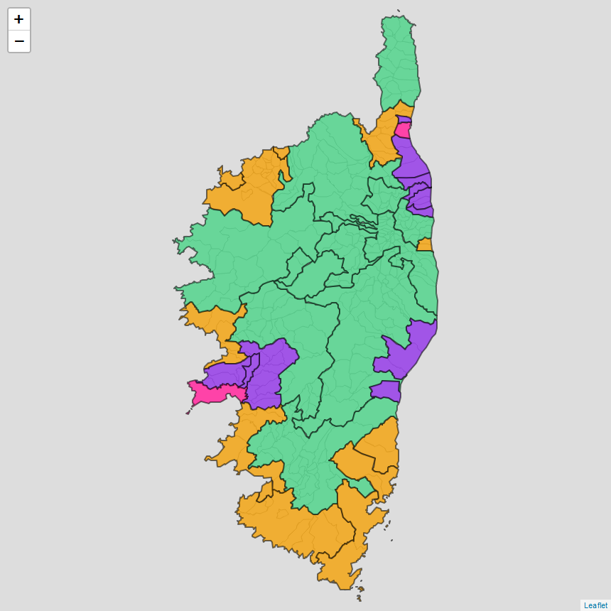</a>

<br>
<br>
<br>

### 2.2) Ajout du "revenu total Airbnb" + "nombre de logements" + MAJ données 

```{r , include=FALSE, eval=F}
rm(list=ls())


nb_mailles=36
population_min=2500

load("Données/Donnees_Logement_MAJ.Rdata")
Donnees_Logement=Donnees_Logement_MAJ
Import_carteCommunesCorses=st_read("Données/SHP_COMMUNES/COMMUNE.shp")
carteCommunesCorses=Import_carteCommunesCorses %>% select(INSEE_COM,geometry)
colnames(carteCommunesCorses)[1]="CODGEO"
carteCommunesCorses=carteCommunesCorses %>% arrange(CODGEO)
carteCommunesCorses <- st_transform(carteCommunesCorses, crs = 4326)

Indicateurs_parCommune= Donnees_Logement %>% 
  mutate(indic.transac = round(100 * nb_mut / LOG, 1),
         indic.menag = round(POP/RP, 1),
         indic.rs = round(100 * RSECOCC / LOG, 1),
         indic.lv = round(100 * LOGVAC / LOG, 1),
         indic.jeun = round(jeun / anc, 1),
         indic.social = round(100 * social / tot_lgmt, 1),
         indic.prop = round(100 * proprietaire / RP, 1),
         indic.duroc = duroc,
         indic.prix = round(100 * moyenne_prix/rev_ucm, 1),
         indic.airbnb.nb_lgmt=round(100*Loc.actives/LOG, 1),
         indic.airbnb.revTot_annee=rev.LTM_tot,
         indic.log=LOG) %>% 
  select(CODGEO,LIBGEO,POP,LOG,contains("indic"))
Indicateurs_parCommune=Indicateurs_parCommune %>% mutate_if(is.numeric, funs(ifelse(is.na(.), 0, .)))


winsorisation= function (x, prob.min = 0.01, prob.max = .99){
  a <- quantile(x, probs = c(prob.min, prob.max))
  x[x > a[2]] <- a[2]
  x[x < a[1]] <- a[1]
  return(x)
}
listeIndicateurs=Indicateurs_parCommune %>% select(contains("indic")) %>% names()
Indicateurs_parCommune[listeIndicateurs]=apply(Indicateurs_parCommune[listeIndicateurs],MARGIN = 2, FUN = winsorisation)
Indicateurs_parCommune_valeurs=Indicateurs_parCommune[listeIndicateurs] 
carteCommunesCorses_spdf=carteCommunesCorses %>% left_join(Indicateurs_parCommune,by="CODGEO")%>% select(CODGEO,LIBGEO,POP) %>%  as("Spatial")
table_voisinage=poly2nb(carteCommunesCorses_spdf,queen=F)
ACP_parCommunes <- Indicateurs_parCommune_valeurs %>%  PCA(graph = F)
nb_dim <- which(ACP_parCommunes$eig[, 3] > 80)[1] 
ACP_parCommunes <- Indicateurs_parCommune_valeurs %>%  PCA(graph = F,ncp = nb_dim)
donnees_pondérations=ACP_parCommunes$ind$coord
pondérations=nbcosts(table_voisinage, data = donnees_pondérations)
table_voisinage_pondérée=nb2listw(table_voisinage, glist = pondérations, style = "C")
arbre_poids_minimal <- mstree(table_voisinage_pondérée)

resultat_skater=skater(edges = arbre_poids_minimal[,1:2],data=donnees_pondérations,ncuts=nb_mailles-1,crit=population_min,vec.crit=Donnees_Logement$POP)

carteMailles=carteCommunesCorses %>% mutate(maille=resultat_skater$groups) %>%  group_by(maille) %>%  summarise(geometry = st_union(geometry))

Maillage=data.frame(CODGEO=Indicateurs_parCommune$CODGEO,maille=resultat_skater$groups)

Indicateurs_parMaille=Maillage %>% 
  left_join(Donnees_Logement, by="CODGEO") %>% 
  group_by(maille) %>% 
  summarise_if(is.numeric, funs(sum(., na.rm = TRUE))) %>% 
  mutate(indic.transac = round(100 * nb_mut / LOG, 1),
         indic.menag = round(POP/RP, 1),
         indic.rs = round(100 * RSECOCC / LOG, 1),
         indic.lv = round(100 * LOGVAC / LOG, 1),
         indic.jeun = round(jeun / anc, 1),
         indic.social = round(100 * social / tot_lgmt, 1),
         indic.prop = round(100 * proprietaire / tot_lgmt, 1),
         indic.duroc = duroc,
         indic.prix = round(100 * moyenne_prix/rev_ucm, 1),
         indic.airbnb=round(100*Loc.actives/LOG, 1),
         indic.airbnb.nb_lgmt=round(100*Loc.actives/LOG, 1),
         indic.airbnb.revTot_annee=rev.LTM_tot,
         indic.log=LOG) %>% 
  select(maille,POP,LOG,contains("indic")) %>% 
  mutate_if(is.numeric, funs(ifelse(is.na(.), 0, .)))


Indicateurs_parMaille_valeurs=Indicateurs_parMaille %>% select(contains("indic"))
Indicateurs_parMaille_valeurs=Indicateurs_parMaille_valeurs %>% apply(MARGIN = 2, FUN = winsorisation)
acp_parMailles=PCA(Indicateurs_parMaille_valeurs,ncp=5,graph=F)
hc4 <- HCPC(acp_parMailles, nb.clust = 4, consol = T, graph = F)
cl4 <- data.frame(maille = Indicateurs_parMaille$maille, cl_maille4 = hc4$data.clust[,"clust"])
carteMaillesSecteurs <- left_join(carteMailles, cl4, by = "maille")

carteCommunesCorses_merged <- left_join(carteCommunesCorses, Donnees_Logement, by = "CODGEO")
carteCommunesCorses_sf <- st_as_sf(carteCommunesCorses_merged)


# Création d'une palette de couleurs pour les secteurs
palSecteurs = colorFactor(palette = c("seagreen3", "orange2","blueviolet", "deeppink"), domain = carteMaillesSecteurs$cl_maille4)
palSecteurs = colorFactor(palette = c("orange2", "seagreen3","deeppink", "blueviolet"), domain = carteMaillesSecteurs$cl_maille4)

# Création d'une carte des communes avec un trait gris fin
carteCommunes = leaflet(carteCommunesCorses_sf) %>%
  addPolygons(fillColor = "white",
              fillOpacity = 0.8,
              color = "gray",
              weight = 1)

# Ajout des mailles avec un trait noir plus épais et colorées selon le secteur
carte_MAJ=carteCommunes %>%
  addPolygons(data = carteMaillesSecteurs,
              fillColor = ~palSecteurs(cl_maille4),
              fillOpacity = 0.8,
              color = "black",
              weight = 2)

widget_fileMAJ2b <- "Cartes_Interactives/carte_interactive_MAJ2b.html"
saveWidget(carte_MAJ, file = widget_fileMAJ2b)
webshot("Cartes_Interactives/carte_interactive_MAJ2b.html", file = "Cartes_Interactives/carteMAJ2b.png",vwidth = 860, vheight = 860)
```

<br>
*Cliquer sur l'image pour afficher la carte interactive*
<a href="Cartes_Interactives/carte_interactive_MAJ2.html" target="_blank"></a>

<br>
<br>
<br>

### 2.3) Ajout du "revenu moyen / logement Airbnb" + "nombre de logements" + MAJ données 

```{r , include=FALSE, eval=F}
rm(list=ls())


nb_mailles=36
population_min=2500

load("Données/Donnees_Logement_MAJ.Rdata")
Donnees_Logement=Donnees_Logement_MAJ
Import_carteCommunesCorses=st_read("Données/SHP_COMMUNES/COMMUNE.shp")
carteCommunesCorses=Import_carteCommunesCorses %>% select(INSEE_COM,geometry)
colnames(carteCommunesCorses)[1]="CODGEO"
carteCommunesCorses=carteCommunesCorses %>% arrange(CODGEO)
carteCommunesCorses <- st_transform(carteCommunesCorses, crs = 4326)

Indicateurs_parCommune= Donnees_Logement %>% 
  mutate(indic.transac = round(100 * nb_mut / LOG, 1),
         indic.menag = round(POP/RP, 1),
         indic.rs = round(100 * RSECOCC / LOG, 1),
         indic.lv = round(100 * LOGVAC / LOG, 1),
         indic.jeun = round(jeun / anc, 1),
         indic.social = round(100 * social / tot_lgmt, 1),
         indic.prop = round(100 * proprietaire / RP, 1),
         indic.duroc = duroc,
         indic.prix = round(100 * moyenne_prix/rev_ucm, 1),
         indic.airbnb.nb_lgmt=round(100*Loc.actives/LOG, 1),
         indic.airbnb.revMoy_lgt=rev.LTM_moy_lgt,
         indic.log=LOG) %>% 
  select(CODGEO,LIBGEO,POP,LOG,contains("indic"))
Indicateurs_parCommune=Indicateurs_parCommune %>% mutate_if(is.numeric, funs(ifelse(is.na(.), 0, .)))


winsorisation= function (x, prob.min = 0.01, prob.max = .99){
  a <- quantile(x, probs = c(prob.min, prob.max))
  x[x > a[2]] <- a[2]
  x[x < a[1]] <- a[1]
  return(x)
}
listeIndicateurs=Indicateurs_parCommune %>% select(contains("indic")) %>% names()
Indicateurs_parCommune[listeIndicateurs]=apply(Indicateurs_parCommune[listeIndicateurs],MARGIN = 2, FUN = winsorisation)
Indicateurs_parCommune_valeurs=Indicateurs_parCommune[listeIndicateurs] 
carteCommunesCorses_spdf=carteCommunesCorses %>% left_join(Indicateurs_parCommune,by="CODGEO")%>% select(CODGEO,LIBGEO,POP) %>%  as("Spatial")
table_voisinage=poly2nb(carteCommunesCorses_spdf,queen=F)
ACP_parCommunes <- Indicateurs_parCommune_valeurs %>%  PCA(graph = F)
nb_dim <- which(ACP_parCommunes$eig[, 3] > 80)[1] 
ACP_parCommunes <- Indicateurs_parCommune_valeurs %>%  PCA(graph = F,ncp = nb_dim)
donnees_pondérations=ACP_parCommunes$ind$coord
pondérations=nbcosts(table_voisinage, data = donnees_pondérations)
table_voisinage_pondérée=nb2listw(table_voisinage, glist = pondérations, style = "C")
arbre_poids_minimal <- mstree(table_voisinage_pondérée)

resultat_skater=skater(edges = arbre_poids_minimal[,1:2],data=donnees_pondérations,ncuts=nb_mailles-1,crit=population_min,vec.crit=Donnees_Logement$POP)

carteMailles=carteCommunesCorses %>% mutate(maille=resultat_skater$groups) %>%  group_by(maille) %>%  summarise(geometry = st_union(geometry))

Maillage=data.frame(CODGEO=Indicateurs_parCommune$CODGEO,maille=resultat_skater$groups)

Indicateurs_parMaille=Maillage %>% 
  left_join(Donnees_Logement, by="CODGEO") %>% 
  group_by(maille) %>% 
  summarise_if(is.numeric, funs(sum(., na.rm = TRUE))) %>% 
  mutate(indic.transac = round(100 * nb_mut / LOG, 1),
         indic.menag = round(POP/RP, 1),
         indic.rs = round(100 * RSECOCC / LOG, 1),
         indic.lv = round(100 * LOGVAC / LOG, 1),
         indic.jeun = round(jeun / anc, 1),
         indic.social = round(100 * social / tot_lgmt, 1),
         indic.prop = round(100 * proprietaire / tot_lgmt, 1),
         indic.duroc = duroc,
         indic.prix = round(100 * moyenne_prix/rev_ucm, 1),
         indic.airbnb=round(100*Loc.actives/LOG, 1),
         indic.airbnb.nb_lgmt=round(100*Loc.actives/LOG, 1),
         indic.airbnb.revMoy_lgt=rev.LTM_moy_lgt,
         indic.log=LOG) %>% 
  select(maille,POP,LOG,contains("indic")) %>% 
  mutate_if(is.numeric, funs(ifelse(is.na(.), 0, .)))


Indicateurs_parMaille_valeurs=Indicateurs_parMaille %>% select(contains("indic"))
Indicateurs_parMaille_valeurs=Indicateurs_parMaille_valeurs %>% apply(MARGIN = 2, FUN = winsorisation)
acp_parMailles=PCA(Indicateurs_parMaille_valeurs,ncp=5,graph=F)
hc4 <- HCPC(acp_parMailles, nb.clust = 4, consol = T, graph = F)
cl4 <- data.frame(maille = Indicateurs_parMaille$maille, cl_maille4 = hc4$data.clust[,"clust"])
carteMaillesSecteurs <- left_join(carteMailles, cl4, by = "maille")

carteCommunesCorses_merged <- left_join(carteCommunesCorses, Donnees_Logement, by = "CODGEO")
carteCommunesCorses_sf <- st_as_sf(carteCommunesCorses_merged)


# Création d'une palette de couleurs pour les secteurs
palSecteurs = colorFactor(palette = c("seagreen3", "orange2","blueviolet", "deeppink"), domain = carteMaillesSecteurs$cl_maille4)
palSecteurs = colorFactor(palette = c("deeppink", "blueviolet","seagreen3", "orange2"), domain = carteMaillesSecteurs$cl_maille4)


# Création d'une carte des communes avec un trait gris fin
carteCommunes = leaflet(carteCommunesCorses_sf) %>%
  addPolygons(fillColor = "white",
              fillOpacity = 0.8,
              color = "gray",
              weight = 1)

# Ajout des mailles avec un trait noir plus épais et colorées selon le secteur
carte_MAJ=carteCommunes %>%
  addPolygons(data = carteMaillesSecteurs,
              fillColor = ~palSecteurs(cl_maille4),
              fillOpacity = 0.8,
              color = "black",
              weight = 2)

widget_fileMAJ3b <- "Cartes_Interactives/carte_interactive_MAJ3b.html"
saveWidget(carte_MAJ, file = widget_fileMAJ3b)
webshot("Cartes_Interactives/carte_interactive_MAJ3b.html", file = "Cartes_Interactives/carteMAJ3b.png",vwidth = 860, vheight = 860)
```

<br>
*Cliquer sur l'image pour afficher la carte interactive*
<a href="Cartes_Interactives/carte_interactive_MAJ3b.html" target="_blank">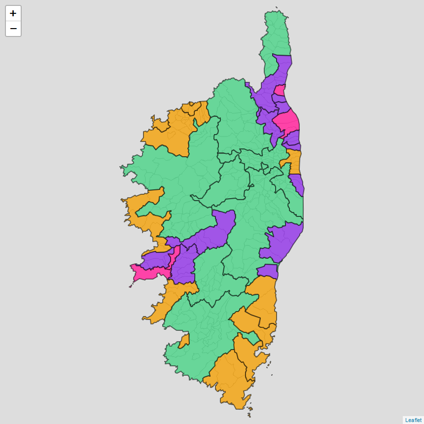</a>

<br>
<br>
<br>
 
  
 
 
 
 
<br>


# Résultat de l'étude initiale

```{r, echo=F, message=F, warning=F, include=F, eval=F}
rm(list=ls())

nb_mailles=36
population_min=2500


library(tidyverse)
library(FactoMineR)
library(spdep)
library(sf)
library(readxl)
library(leaflet)
library(leaflet.extras)
library(htmlwidgets)
load("Données/Donnees_Logement_2017.RData")
importsAirDNA <- read_excel("Données/stat_airdna_aout2020_mod.xlsx", range = "A4:I364")
Import_carteCommunesCorses=st_read("Données/SHP_COMMUNES/COMMUNE.shp")
carteCommunesCorses=Import_carteCommunesCorses %>% select(INSEE_COM,geometry)
colnames(carteCommunesCorses)[1]="CODGEO"
carteCommunesCorses=carteCommunesCorses %>% arrange(CODGEO)
carteCommunesCorses <- st_transform(carteCommunesCorses, crs = 4326)
airDNA=importsAirDNA %>% select(2,4)
colnames(airDNA)=c("CODGEO","Loc.actives")
Donnees_Logement_2017=Donnees_Logement_2017 %>% inner_join(airDNA, by="CODGEO")
Indicateurs_parCommune= Donnees_Logement_2017 %>% 
  mutate(indic.transac = round(100 * nb_mut / LOG, 1),
         indic.menag = round(POP/RP, 1),
         indic.rs = round(100 * RSECOCC / LOG, 1),
         indic.lv = round(100 * LOGVAC / LOG, 1),
         indic.jeun = round(jeun / anc, 1),
         indic.social = round(100 * social / tot_lgmt, 1),
         indic.prop = round(100 * proprietaire / tot_lgmt, 1),
         indic.duroc = duroc,
         indic.prix = round(100 * moyenne_prix/rev_ucm, 1),
         indic.airbnb=round(100*Loc.actives/LOG, 1)) %>% 
  select(CODGEO,LIBGEO,POP,LOG,contains("indic"))
Indicateurs_parCommune=Indicateurs_parCommune %>% mutate_if(is.numeric, funs(ifelse(is.na(.), 0, .)))
winsorisation= function (x, prob.min = 0.01, prob.max = .99){
  a <- quantile(x, probs = c(prob.min, prob.max))
  x[x > a[2]] <- a[2]
  x[x < a[1]] <- a[1]
  return(x)
}
listeIndicateurs=Indicateurs_parCommune %>% select(contains("indic")) %>% names()
Indicateurs_parCommune[listeIndicateurs]=apply(Indicateurs_parCommune[listeIndicateurs],MARGIN = 2, FUN = winsorisation)
Indicateurs_parCommune_valeurs=Indicateurs_parCommune[listeIndicateurs] 
carteCommunesCorses_spdf=carteCommunesCorses %>% left_join(Indicateurs_parCommune,by="CODGEO")%>% select(CODGEO,LIBGEO,POP) %>%  as("Spatial")
table_voisinage=poly2nb(carteCommunesCorses_spdf,queen=F)
ACP_parCommunes <- Indicateurs_parCommune_valeurs %>%  PCA(graph = F)
nb_dim <- which(ACP_parCommunes$eig[, 3] > 80)[1] 
ACP_parCommunes <- Indicateurs_parCommune_valeurs %>%  PCA(graph = F,ncp = nb_dim)
donnees_pondérations=ACP_parCommunes$ind$coord
pondérations=nbcosts(table_voisinage, data = donnees_pondérations)
table_voisinage_pondérée=nb2listw(table_voisinage, glist = pondérations, style = "C")
arbre_poids_minimal <- mstree(table_voisinage_pondérée)

resultat_skater=skater(edges = arbre_poids_minimal[,1:2],data=donnees_pondérations,ncuts=nb_mailles-1,crit=population_min,vec.crit=Donnees_Logement_2017$POP)

carteMailles=carteCommunesCorses %>% mutate(maille=resultat_skater$groups) %>%  group_by(maille) %>%  summarise(geometry = st_union(geometry))

Maillage=data.frame(CODGEO=Indicateurs_parCommune$CODGEO,maille=resultat_skater$groups)

Indicateurs_parMaille=Maillage %>% 
  left_join(Donnees_Logement_2017, by="CODGEO") %>% 
  group_by(maille) %>% 
  summarise_if(is.numeric, funs(sum(., na.rm = TRUE))) %>% 
  mutate(indic.transac = round(100 * nb_mut / LOG, 1),
         indic.menag = round(POP/RP, 1),
         indic.rs = round(100 * RSECOCC / LOG, 1),
         indic.lv = round(100 * LOGVAC / LOG, 1),
         indic.jeun = round(jeun / anc, 1),
         indic.social = round(100 * social / tot_lgmt, 1),
         indic.prop = round(100 * proprietaire / tot_lgmt, 1),
         indic.duroc = duroc,
         indic.prix = round(100 * moyenne_prix/rev_ucm, 1),
         indic.airbnb=round(100*Loc.actives/LOG, 1)) %>% 
  select(maille,POP,LOG,contains("indic")) %>% 
  mutate_if(is.numeric, funs(ifelse(is.na(.), 0, .)))


Indicateurs_parMaille_valeurs=Indicateurs_parMaille %>% select(contains("indic"))
Indicateurs_parMaille_valeurs=Indicateurs_parMaille_valeurs %>% apply(MARGIN = 2, FUN = winsorisation)
acp_parMailles=PCA(Indicateurs_parMaille_valeurs,ncp=5,graph=F)
hc4 <- HCPC(acp_parMailles, nb.clust = 4, consol = T, graph = F)
cl4 <- data.frame(maille = Indicateurs_parMaille$maille, cl_maille4 = hc4$data.clust[,"clust"])
carteMaillesSecteurs <- left_join(carteMailles, cl4, by = "maille")

carteCommunesCorses_merged <- left_join(carteCommunesCorses, Donnees_Logement_2017, by = "CODGEO")
carteCommunesCorses_sf <- st_as_sf(carteCommunesCorses_merged)


# Création d'une palette de couleurs pour les secteurs
palSecteurs = colorFactor(palette = c("seagreen3", "orange2","blueviolet", "deeppink"), domain = carteMaillesSecteurs$cl_maille4)


# Création d'une carte des communes avec un trait gris fin
carteCommunes = leaflet(carteCommunesCorses_sf) %>%
  addPolygons(fillColor = "white",
              fillOpacity = 0.8,
              color = "gray",
              weight = 1)

# Ajout des mailles avec un trait noir plus épais et colorées selon le secteur
carte_INI=carteCommunes %>%
  addPolygons(data = carteMaillesSecteurs,
              fillColor = ~palSecteurs(cl_maille4),
              fillOpacity = 0.8,
              color = "black",
              weight = 2)

widget_fileINI <- "Cartes_Interactives/carte_interactive_INI.html"
saveWidget(carte_INI, file = widget_fileINI)
webshot("Cartes_Interactives/carte_interactive_INI.html", file = "Cartes_Interactives/carteINI.png",vwidth = 860, vheight = 860)
```

<br>
*Cliquer sur l'image pour afficher la carte interactive*
<a href="Cartes_Interactives/carte_interactive_INI.html" target="_blank">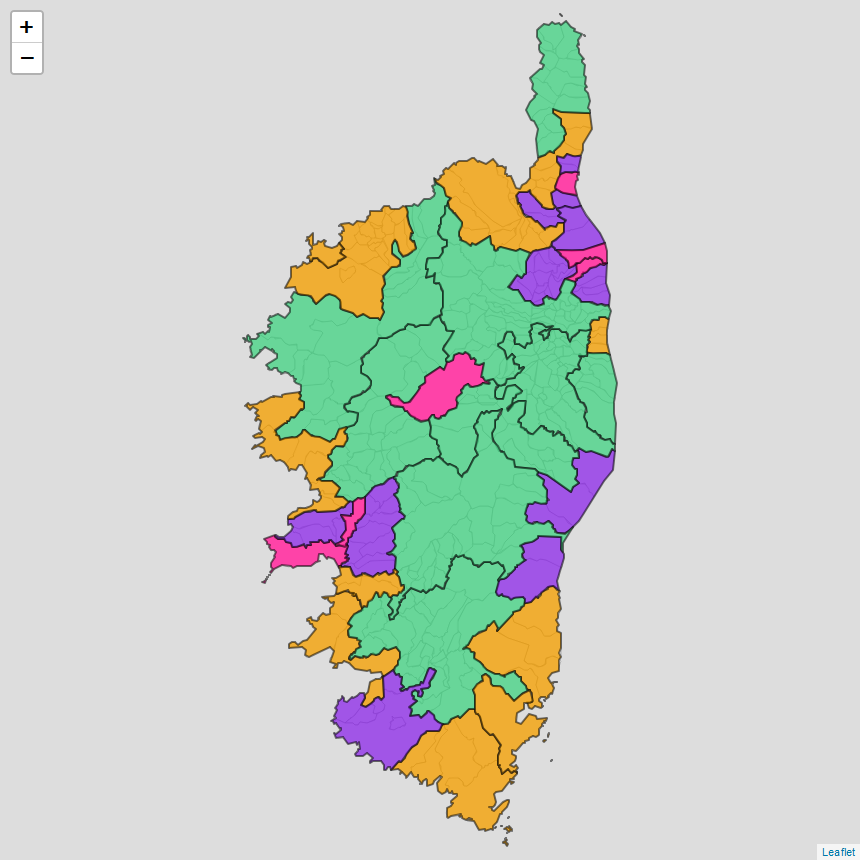</a>


<!-- 
Script pour mettre à jour les données 
-->

```{r MAJ_Donnees, echo=F, eval=F}
load("Données/Donnees_Logement_2017.RData")
load("Données/Bases_INSEE_Corse_2019.Rdata")
ImportAirDNA=read.csv("Données/IndicateursAirDNA.csv",sep=";")
colnames(ImportAirDNA)[1]="CODGEO"
ImportINSEE=read_excel("Données/EnvoiINSEE.xlsx")
colnames(ImportINSEE)[1]="CODGEO"
ImportFILOCOM_cube1=read.csv("Données/cube1_2019.csv",sep=";")
ImportFILOCOM_cube2=read.csv("Données/cube2_2019.csv",sep=";")
ImportFILOCOM_cube3=read.csv("Données/cube3_2019.csv",sep=";")
ImportFILOCOM_cube4a=read.csv("Données/cube4a_2019.csv",sep=";")
ImportFILOCOM_cube4b=read.csv("Données/cube4b_2019.csv",sep=";")
colnames(ImportFILOCOM_cube1)[2]="CODGEO"
colnames(ImportFILOCOM_cube2)[2]="CODGEO"
colnames(ImportFILOCOM_cube3)[2]="CODGEO"
colnames(ImportFILOCOM_cube4a)[2]="CODGEO"
colnames(ImportFILOCOM_cube4b)[2]="CODGEO"
Import_DV3F=read.csv("Données/dv3fep_0723_lgmt_app_com_1821.csv",sep=";")
colnames(Import_DV3F)[2]="CODGEO"


Donnees_Cube1 = Donnees_Logement_2017 %>% 
                left_join(ImportINSEE, by = "CODGEO") %>% 
                left_join(ImportFILOCOM_cube1, by = "CODGEO")
Donnees_Cube1[, 3:ncol(Donnees_Cube1)] = Donnees_Cube1[, 3:ncol(Donnees_Cube1)] %>%  mutate_all(as.numeric)
# jeunesse du parc
Donnees_Cube1=Donnees_Cube1 %>% 
              mutate(anc=Parc_tot.1915+Parc_tot_1915.1948,
                     jeun=Parc_tot_1975.1981+Parc_tot_1982.1989+Parc_tot_1990.1998+Parc_tot.1999)
Donnees_Cube1=Donnees_Cube1 %>% 
              mutate(anc = ifelse(is.na(anc), `Avant 1946`, anc), 
                   jeun = ifelse(is.na(jeun), `Après 70`, jeun),
                   tot_lgmt=ifelse(is.na(Parc_total), tot_lgmt, Parc_total))
Donnees_Cube1=Donnees_Cube1 %>% select(CODGEO,LIBGEO,tot_lgmt,jeun,anc, RP_Filocom=RP.y)


Donnees_social=Donnees_Logement_2017  %>% 
              left_join(ImportFILOCOM_cube2,by="CODGEO") %>% 
              select(CODGEO, Parc_tot_HLM_SEM, social)
Donnees_social[, 2:ncol(Donnees_social)] <- Donnees_social[, 2:ncol(Donnees_social)] %>%  mutate_all(as.numeric)
Donnees_social=Donnees_social %>% 
              mutate(social=ifelse(is.na(Parc_tot_HLM_SEM), social, Parc_tot_HLM_SEM)) %>% 
              select(CODGEO, social)


Donnees_duroc=Donnees_Logement_2017  %>% 
              left_join(ImportFILOCOM_cube4a,by="CODGEO") %>% 
              select(CODGEO, Total_menages_duroc_mediane, duroc)
Donnees_duroc[, 2:ncol(Donnees_duroc)] <- Donnees_duroc[, 2:ncol(Donnees_duroc)] %>%  mutate_all(as.numeric)
Donnees_duroc=Donnees_duroc %>% 
              mutate(duroc=ifelse(is.na(Total_menages_duroc_mediane), duroc, Total_menages_duroc_mediane)) %>% 
              select(CODGEO, duroc)


Donnees_AirDNA=ImportAirDNA %>% select(CODGEO, Loc.actives=nb_logmt, rev.LTM_tot, rev.LTM_moy_lgt)
Donnees_AirDNA$rev.LTM_moy_lgt=gsub(",", ".", Donnees_AirDNA$rev.LTM_moy_lgt)
Donnees_AirDNA[, 2:ncol(Donnees_AirDNA)]=Donnees_AirDNA[, 2:ncol(Donnees_AirDNA)] %>%  mutate_all(as.numeric)


Donnees_INSEE=baseLogementINSEE_Corse_2019 %>% 
              left_join(basePopulationINSEE_Corse_2019, by="CODGEO") %>% 
              select(CODGEO,POP=P19_POP,LOG=P19_LOG, RP=P19_RP, RSECOCC=P19_RSECOCC, LOGVAC=P19_LOGVAC,RP_PROP=P19_RP_PROP,proprietaire=P19_RP_PROP)

Donnees_DV3F= Import_DV3F %>% select(CODGEO, nb_mut=lgmt.nb_mut, moyenne_prix=lgmt.moy_prix_frais)

Donnees_rev_ucm = ImportFILOCOM_cube4b %>% select(CODGEO, rev_ucm=Total_menages_rev_brut_ucm_mediane)

Donnees_Logement_MAJ=Donnees_Cube1 %>% 
  left_join(Donnees_DV3F,by="CODGEO")  %>% 
  left_join(Donnees_INSEE,by="CODGEO")  %>% 
  left_join(Donnees_social,by="CODGEO") %>% 
  left_join(Donnees_duroc,by="CODGEO") %>% 
  left_join(Donnees_rev_ucm,by="CODGEO") %>% 
  left_join(Donnees_AirDNA,by="CODGEO")


rm(list=setdiff(ls(), "Donnees_Logement_MAJ"))

save(Donnees_Logement_MAJ,file="Données/Donnees_Logement_MAJ.Rdata")

```


</div>


